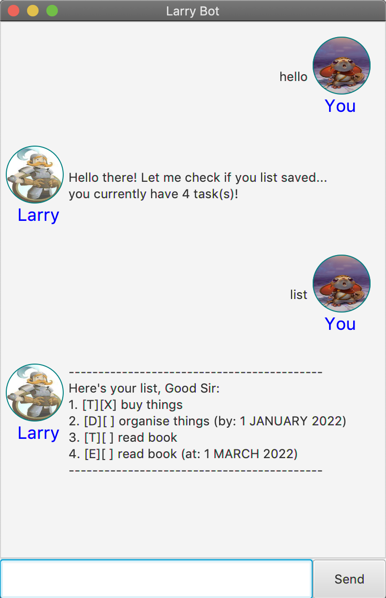

# Daphne

This is Daphne, a friendly bot to help you keep track of your tasks! 

## Commands

Here are some things Daphne can do for you.

Hello: `hello`  
List All Commands: `help`
Track To-Dos: `todo <desc>`  
Track Deadlines: `deadline <desc> /by <date> <time>`  
Track Events: `event <desc> /at <start_date> <start_time> <end_date> <end_time>`
Mark Tasks: `mark <index>`  
Unmark Tasks: `unmark <index>`
Delete Tasks: `delete <index>` (deletes the task at the specified index), `reset` (deletes all tasks)
Find Tasks: `find <keyword>`  
List Tasks: `list`  
UwU: `uwu`  
OwO: `owo`  
Terminate Program: `bye`  
