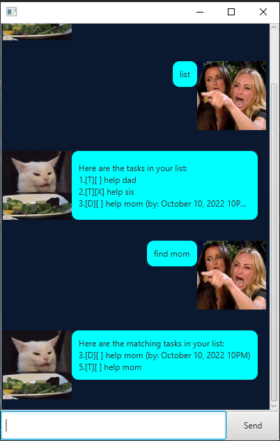
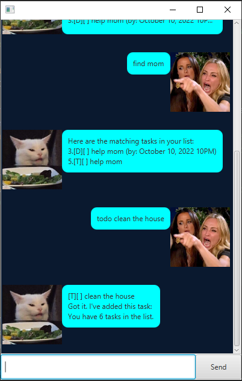
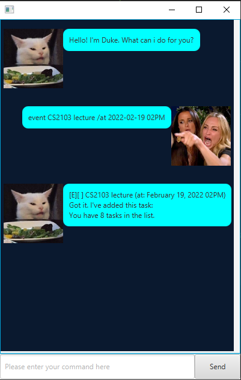
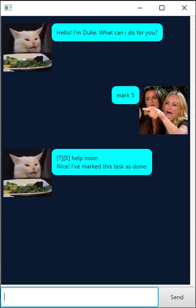
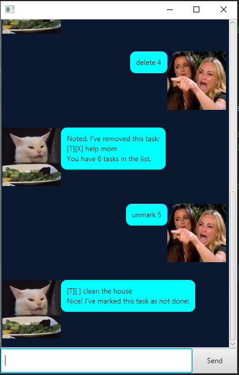
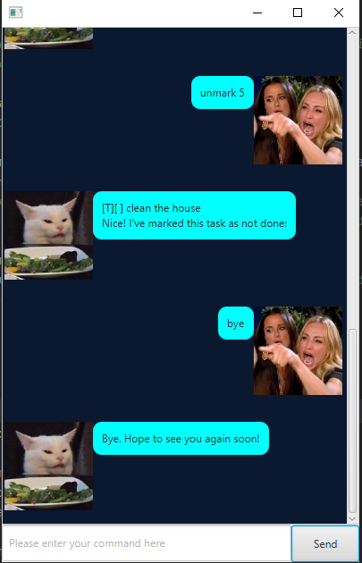

# User Guide to Meow

Meow is a desktop application for users to keep track of various task they would like do. 
There are numerous functions in the application that can assist you in tracking your tasks.

* Features & Usage
   * [1. List the tasks currently tracked](#1-list-the-tasks-currently-tracked)
   * [2. Find a task using a keyword](#2-find-a-task-using-a-keyword)
   * [3. Create a Task](#3-create-a-task)
      * [3.1 Create a Todo](#31-create-a-todo)
      * [3.2 Create a Deadline](#32-create-a-deadline)
      * [3.3 Create an Event](#33-create-an-event)
   * [4. Mark & Unmark](#4-mark-and-unmark)
      * [4.1 Mark a Task](#41-mark-a-task)
      * [4.2 Unmark a Task](#42-unmark-a-task)
   * [5. Delete a Task](#5-delete-a-task)
   * [6. Exit the programme](#6-exit-the-programme)

## **1. List the tasks currently tracked**

This feature allows the user to display all task that they are currently tracking.

We will be able to see Task:
   1. Type
   2. Completion
   3. Description
   4. Deadline/StartTime

*Usage*: We would like to see what tasks we are currently tracking.

*Format*: `list`

*Examples*: `list`

 
## **2. Find a task using a keyword**

This feature allows the user to search for a group of tasks using keywords.

*Usage*: We would like to see if we have any task relating to mom.

*Format*: `find [keyword]`

*Examples*: `find mom`

 
## **3. Create a Task**

We are able to create tasks to keep tracks of.
Different tasks type will be able to keep track of different things.

There are 3 types of tasks we can keep track of:
   1. [Todo](#31-create-a-todo)
   2. [Deadline](#32-create-a-deadline)
   3. [Event](#33-create-an-event)

### **3.1 Create a Todo**

This feature allows the user to create a Todo task.
A Todo task stores:
   1. Type
   2. Completion
   3. Description

*Usage*: We would like to clean the house soon.

*Format*: `todo [Description]`

*Examples*: `todo clean the house`

### **3.2 Create a Deadline**

This feature allows the user to create a Deadline task.
A Todo task stores:
   1. Type
   2. Completion
   3. Description
   4. Deadline

*Usage*: We have a CS2103 assignment due on 19-02-2022 11PM.

*Format*: `event [Description] /by YYYY-MM-DD HHA`

*Examples*: `deadline CS2103 assisngment /by 2022-02-19 11PM`

### **3.3 Create an Event**

This feature allows the user to create an Event task.
A Todo task stores:
   1. Type
   2. Completion
   3. Description
   4. StartTime

*Usage*: We have a CS2103 lecture at 19-02-2022 2PM.

*Format*: `event [Description] /at YYYY-MM-DD HHA`

*Examples*: `event CS2103 lecture /at 2022-02-19 02PM`

## **4. Mark and Unmark**

We are able to indicate if the task has been completed by marking or unmarking them.
   1. [Mark a Task](#41-mark-a-task)
   2. [Unmark a Task](#42-unmark-a-task)

### **4.1 Mark a Task**

This feature allows the user indicate that the task has been completed.

*Usage*: We have completed task 5 on the list.

*Format*: `mark [task index]`

*Examples*: `mark 5`

### **4.2 Unmark a Task**

This feature allows the user indicate that the task has not been completed.

*Usage*: We realised that there is extra work on task 5.

*Format*: `unmark [task index]`

*Examples*: `unmark 5`

   
## **5. Delete a Task**

This feature allows the user to delete a task from the list.

*Usage*: The deadline for task 4 has pass and we no longer have to keep track of it.

*Format*: `delete [task index]`

*Examples*: `delete 4`

## **6. Exit the programme**

This feature allows the user to exit the programme.

*Usage*: I have finish what I am doing and would like to exit the application

*Format*: `bye`

*Examples*: `bye`

