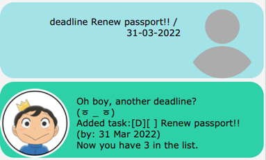
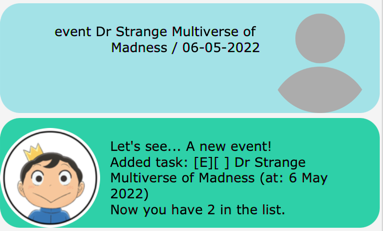

# Duke Reminders Bot

**Duke** is automated ChatBot which allows user *track* their daily tasks, deadlines, events. It is available both in a **Command Line Interface** format and a **Graphical User Interface** format.

## Quick Start

1. Download all the prerequisite software (Java 11).
2. Download the latest release from this [link](https://github.com/AryanSarswat/ip/releases/download/A-FullCommitMessage/Duke.jar).
3. Double-click the file to start the application, a GUI should pop up allow you to enter commands into a text box.
 
\
Here is a sample image of what you should expect:

4. You may type help to get a list of all available commands and their respective syntax.
5. Otherwise, refer to [Usage](#usage) below for details on using each command.

## Features 

### Add and delete Tasks

Duke supports the ability to add and delete 3 main types of tasks:
1. Todo Tasks (Tasks with descriptions)
2. Deadline Tasks (Tasks with descriptions and deadlines)
3. Event Tasks (Tasks with descriptions and dates and time of event)

### Saving and Loading of Tasks

Duke is able to **save tasks** in a concise text file which can be **loaded up** at a later time,

### Finding Tasks

Duke supports a find feature which allows user to **search for specific tasks using keywords**.

### Mark/Unmark as Done

Duke allows user to mark a task as done :white_check_mark: or as undone :negative_squared_cross_mark: depending on whether they have completed the task.

## Usage

### `list` - lists all the current tasks

This command will display all the details regarding the various tasks which the user has currently.

Example of usage: 

`list`

Expected outcome:

### `todo` - adds a Todo task

This command will add a Todo task which contains a description.

Example of usage:

`todo {description of task}`

Expected outcome:

### `deadline` - adds a Deadline task

This command will add a deadline task which contains a description accompanied by a date and time of deadline.

Example of usage:

`deadline {description of task} /by {Time in the format: yyyy/MM/dd HH:mm}`

Expected outcome:

### `event` - adds a Event task

This command will add an Event task which contains a description accompanied by a date and time of the event.

Example of usage:

`event {description of task} /by {Time in the format: yyyy/MM/dd HH:mm}`

Expected outcome:

### `mark/unmark` - mark a task as complete or incomplete

This commands allows the user to mark a task as finished or not finished

Example of usage:

`mark {index of task to mark}`

or 

`unmark {index of task to mark}`

Expected outcome:

### `delete` - deletes a task

This command will delete a task from Duke's current task list.

Example of usage:

`delete {index of task to delete}`

Expected outcome:

### `find` - finds a specific task

This command search through the tasklist for any tasks which match a keyword being searched for.

Example of usage:

`find {keyword to search for}`

Expected outcome:

### `bye` - exits the applcation

This command will save all your current tasks and then exit the applcation

Example of usage:

`bye`

