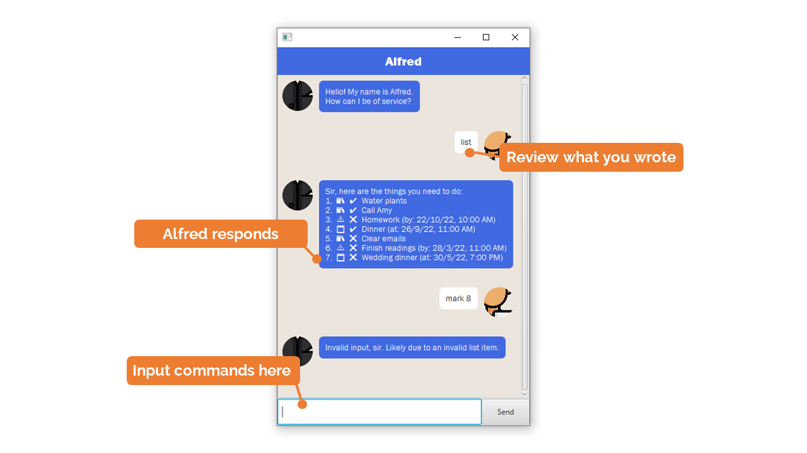
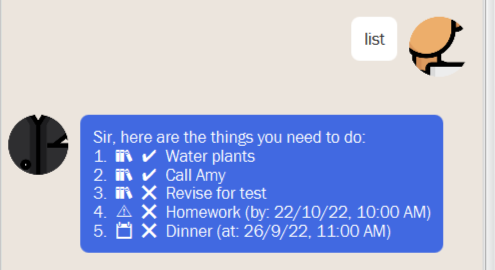
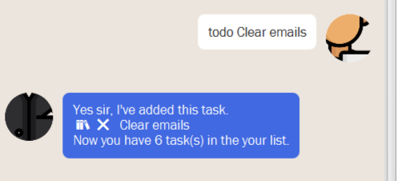
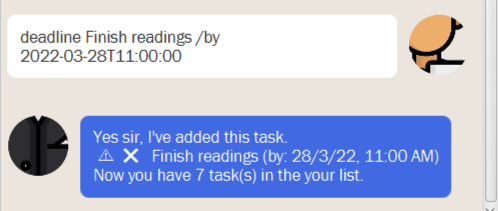
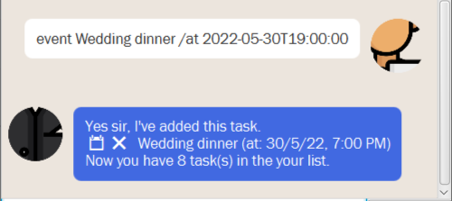
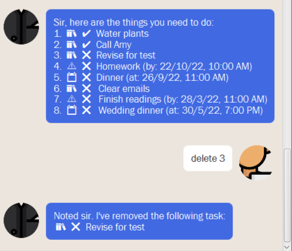
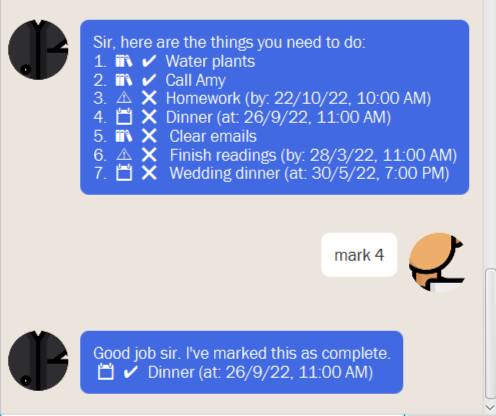
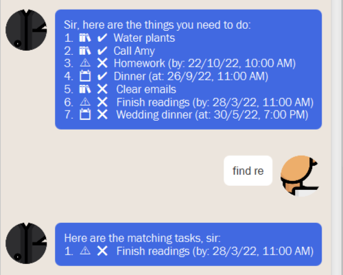

# User Guide


## Table of contents
[1. Features](#features)

## Features

### Add and delete tasks

`Alfred` helps you keep track of different tasks, which you can freely 
`add` and `delete`.

### Keep track of different task types

`Alfred` allows you to keep track of three types of tasks:

1.  📚`ToDo` tasks which only have a description
2. ⚠️`Deadline` tasks that have a description and due date
3. 📆`Event` tasks that describe an event occurring at a date

### Mark progress

With the different task types, you can mark a given task as done ✔️, but 
by default it is marked incomplete ❌. 

### Save and load

Every task you add is saved by default to a local file, and loaded upon
every start of `Alfred`.

### Emoji representations for easy reading

`Alfred` uses emojis to make the user interface more readable. Here is a legend
for reference.

#### Task types
* 📚 `ToDo`
* 📆 `Event` 
* ⚠️ `Deadline` 

#### Task completion status

* ✔️ `Completed` 
* ❌ `Incomplete`

### Find tasks by keywords

`Alfred` allows you to find a task by using a matching keyword. Think of it
as a quick (internal) google to find tasks with similar names.


## Usage

### How to use UI

Key in commands in the text box. Your input will be shown on the right,
in white, while the responses will be shown in blue, on the left.



### `list` lists all tasks being tracked

The `list` command allows you see all tasks being tracked by `Alfred`. 
It shows you the task type and completion status. 

Example of usage:

```
list
```

Expected outcome:

`Alfred` lists everything. 



### `todo` adds a task with only a description

The `todo` command is followed by a string description of an event 
in the format of

```
todo <task name>
```

`Alfred` will then reply with a 
confirmation and a summary of all your tasks.

Example of usage:

```
todo Clear emails
```

Expected outcome:

A confirmation from `Alfred`.




### `deadline` adds a task with a deadline

The `deadline` command is followed by a string description, a `/by` keyword 
and then a date and time in ISO format, such that we have

```
deadline <task name> /by <YYYY-MM-DDTHH:mm:ss>
```

Example of usage:

```
deadline Finish readings /by 2022-03-28T11:00:00
```

Expected outcome:

Like `todo`, we will get a reply.



### `event` adds a task with a time of occurence

The `event` command is followed by a string description, a `/at`keyword and 
then a date and time in ISO format, such that we have

```
event <task name> /at <YYYY-MM-DDTHH:mm:ss>
```

Example of usage:

```
event Wedding dinner /at 2022-05-30T19:00:00
```

Expected outcome:

Again, we expect a confirmation and summary of tasks.



### `delete` to delete tasks

We can delete tasks by their index. We could use `list` to see each task, 
and then delete them by:

```
delete <task number>
```

Example usage:

```
delete 3
```

Expected output

There will be a confirmation of the task being deleted.



### `mark` and `unmark` allow you to mark or unmark tasks

The `mark` and `unmark` tasks are virtually identical, and are used for
(un)marking the completion status of a given task.

You use it by following

```
unmark <task number>
mark <task number>
```

Example of usage:

```
mark 4
```

Expected outcome:

A confirmation will be provided.



### `find` helps you find a task with a keyword

You can find a task by using a keyword that might match the name of the 
task you are looking for. 

`Alfred` will list the tasks whose descriptions your keyword string appears in. 

The syntax for use is:

```
find <keyword string>
```

Example of usage:

```
find re
```

Expected outcome: 

A list of tasks that contain your keyword. In this case, "Finish readings" 
contains "re". 




### `bye` closes the application 

To close the application, simply key in the `bye` command. 

Example of usage:

```
bye
```