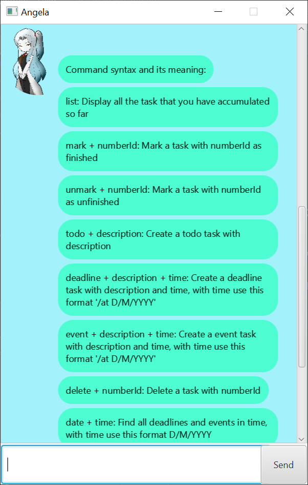
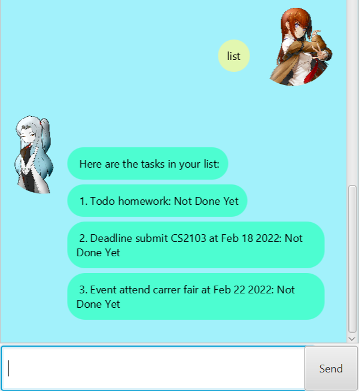
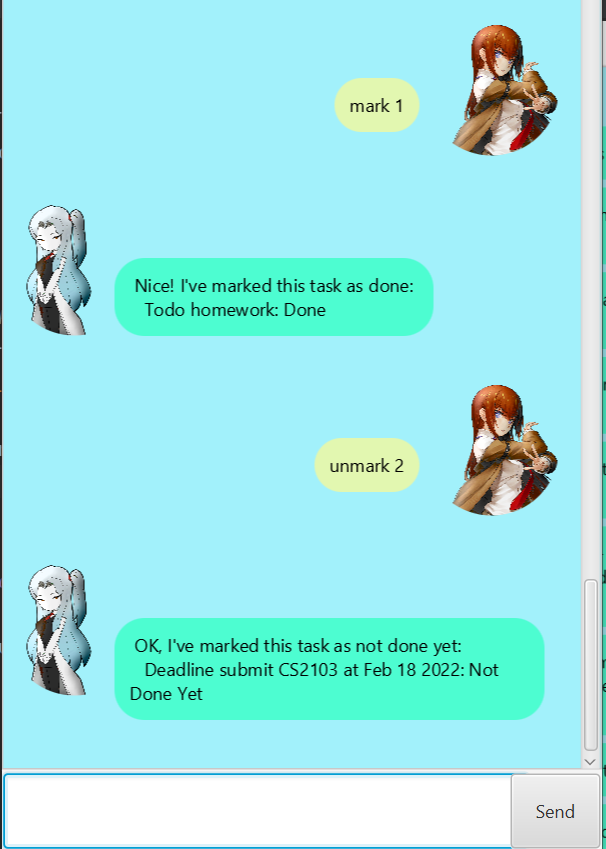
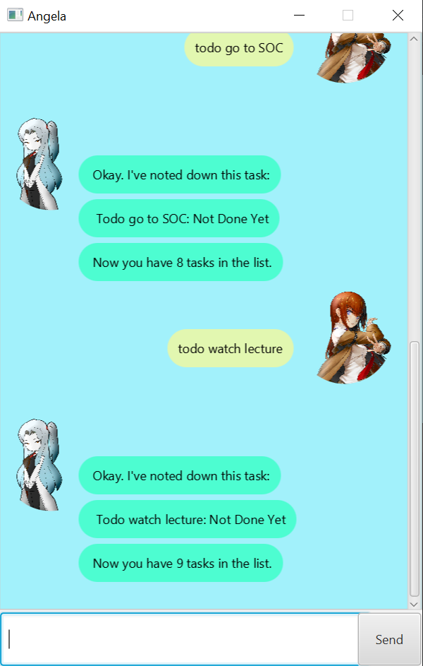
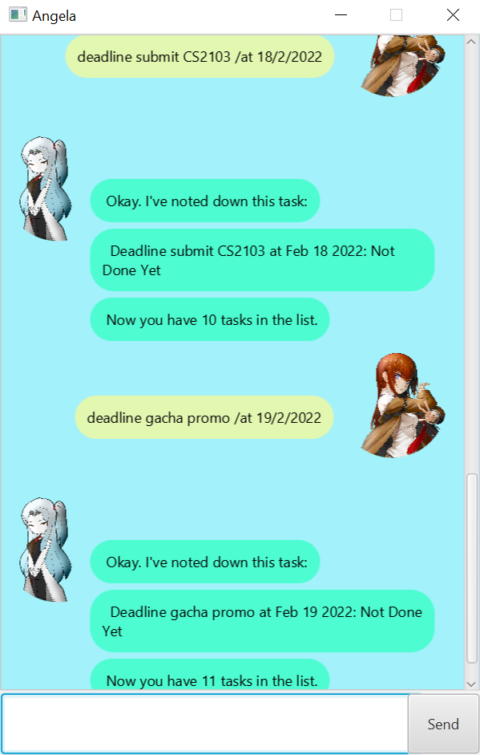
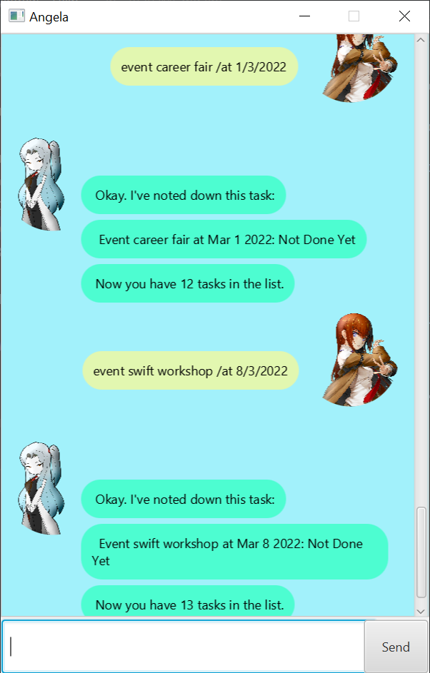
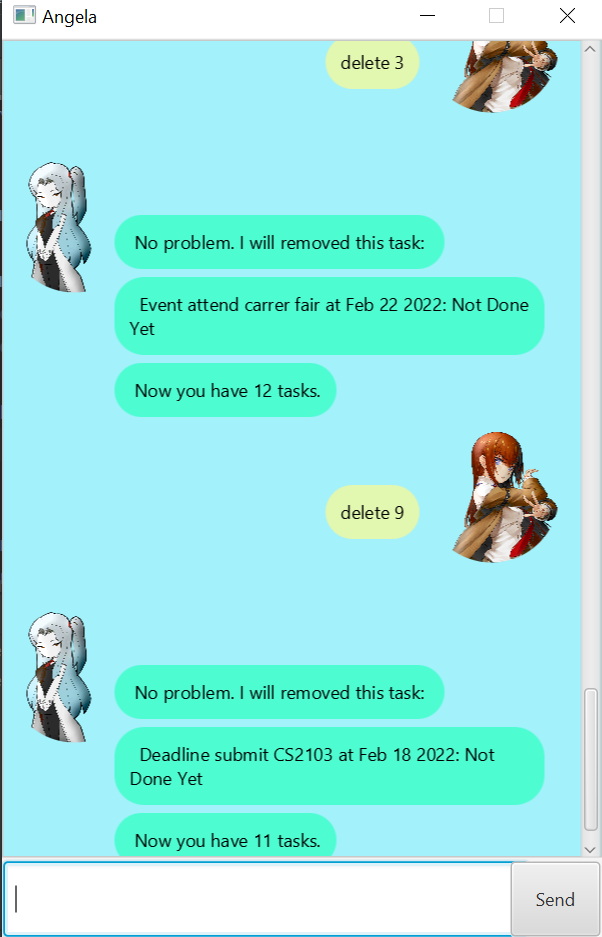
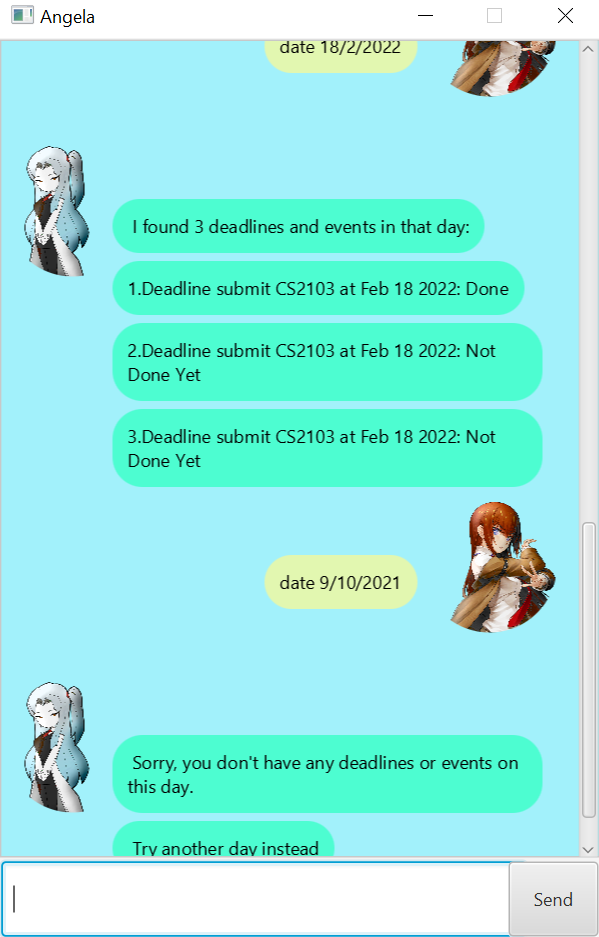

# User Guide
Welcome to ***Angela***, your personal **task manager** assistant. 

Are you _fear of missing out_ upcoming **deadlines** and **tasks**? Do you want 
to take _a lot of responsibilities_ but don't think you can **manage** them? 
Worry no more, because **_Angela_** will take care for you those menial and exhausting tasks. 

Using a friendly **Graphic User Interface (GUI)** and **_kawaii_ profile picture**, 
handling those deadlines with **_Angela_** is going to be **_fun_** and **_relaxing_**. Just simply download 
and open the **_Angela_**, and you are good to go.

- [Quick start](#quick-start)
- [Features](#features)
  - [Viewing help](#viewing-help-help)
  - [View all tasks](#view-all-tasks-list)
  - [Change tasks status](#change-tasks-status-mark--unmark)
  - [Create todo task](#create-todo-task-todo)
  - [Create deadline task](#create-deadline-task-deadline)
  - [Create event](#create-event-event)
  - [Delete task](#delete-task-delete)
  - [Find all tasks in a date](#find-all-tasks-in-a-date-date)
  - [Find a specific task by some keyword](#find-a-specific-task-by-some-keyword-find)
  - [End the program](#end-the-program-bye)
- [FAQ](#faq)

## Quick start
1. Ensure you have `Java 11` or above installed in your Computer.
2. Download the latest `angela.jar` from [here](https://github.com/khoahre123/ip/releases).
3. Copy the file to the folder you want to use as the _home folder_ for **_Angela_**.
4. Double-click the file to start the app. There will be guide for newcomers when **_Angela_** started.

## Features

### **_Note about the command format_**
- `task_Id` means that the id of your task (You can find it using `list`).
- `description` means the content of the task that user want to add.
- `time` means when the tasks are happening, and is written with format `/at D/M/YYYY`.
- `find_date` means the date you want to find tasks, and is written with format `D/M/YYYY`.
- `keyword` means the keyword that you think the task contain (eg: "hom" in "homework)

### Viewing help: `help`
**_Angela_** shows all commands and their respective descriptions to the user.
This is helpful for beginners and users who forgot the syntax of a command.

Format: `help`

_**Expected outcome:**_

### View all tasks: `list`
**_Angela_** keep tracks of all your tasks since you launch **_Angela_** for the first time.
Hence, you can easily view back what those tasks are and their status simply by entering `list`.

Format: `list`

_**Expected outcome:**_

### Change tasks status: `mark` \ `unmark`
When you think that you have finished a task or just change your mind about the completeness of some tasks,
you can simply tell **_Angela_** which task you want to change status, and _**Angela**_ will note that down.

Format: `mark task_Id` to change task status to complete and `unmark task_Id` for the opposite

Example of usage: 
- `mark 1`: Mark the first task in the list as **finished**.
-  `unmark 2`: Mark the second task in the list as **not finished**.

_**Expected outcome:**_

### Create todo task: `todo`
If you have any task need to do, that doesn't have any deadline, then 
**_Angela_** `todo` task is perfect for you.

Format: `todo description`

Example of usage:
- `todo go to SOC`: Create a `todo` task with "go to SOC" as its context.
- `todo watch lecture`: Create a `todo` task with "watch lecture" as its context.

_**Expected outcome:**_

### Create deadline task: `deadline`
If you need to do something, and its have a fixed deadline, then no worry, **_Angela_**
will help you manage them by using `deadline`.

Format: `deadline description time`

Example of usage:
- `deadline submit CS2103 /at 18/2/2022`: Create a `deadline` task that due at 
"18/2/2022" and have "submit CS2103" as its content.
- `deadline gacha promo /at 19/2/2022`: Create a `deadline` task that due at
"19/2/2022" and have "gacha promo" as its content.

_**Expected outcome:**_

### Create event: `event`
If there is an event that you need to attend, simply tell **_Angela_** to record it down
and don't need to think about it anymore.

Format: `event description time`

Example of usage:
- `event career fair /at 1/3/2022`: Create an event about "career fair" that going to happen 
at 1/3/2022.
- `event swift workshop /at 8/3/2022`: Create an event about "swift workshop" that going to happen
at 8/3/2022.

_**Expected outcome:**_

### Delete task: `delete`
If you feel like you don't need to keep track of a specific task, you can ask **_Angela_** to remove
the task list.

Format: `delete task_Id`

Example of usage:
- `delete 3`: Delete the third task in the list.
- `delete 9`: Delete the ninth task in the list.

_**Expected outcome:**_

### Find all tasks in a date: `date`
You want to find which deadlines or events that you need to do in tomorrow? Rather than 
going through every one of them in your memory, you just simply ask **_Angela_** and 
everything will be showed clearly to you.

Format: `date find_date`

Example of usage:
- `date 18/2/2022`: Find all deadlines and events that happen in 18/2/2022.
- `date 9/10/2021`: Find all deadlines and events that happen in 9/10/2022.

_**Expected outcome:**_

### Find a specific task by some keyword: `find`
Want to find a specific task, but you don't want to scroll through the task list?
Then with `find` and some keyword, **_Angela_** will list down all the potential 
task for you. No more hard scrolling right.

Format: `find keyword`

Example of usage:
- `find CS2103`: Find all tasks have "CS2103" in their description.
- `find play game`: Find all tasks have "play game" in their description.

_**Expected outcome:**_

### End the program: `bye`
You won't have to keep **_Angela_** open all the time. When you think you have finished 
adding all the tasks, you can say `bye` to **_Angela_**. Don't worry, all your tasks will be
store in an external database for future open.

Format: `bye`

_**Expected outcome:**_

## FAQ
Q: Can I use on other OS system (e.g. macOS, Linux)?
A: Yes, you can. _**Angela**_ is made to suitable for all 
operating system. Just make sure that you have install Java 11 beforehand.
