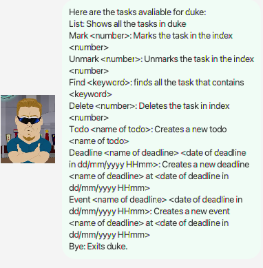
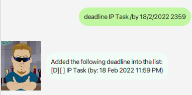
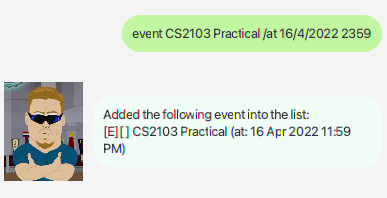
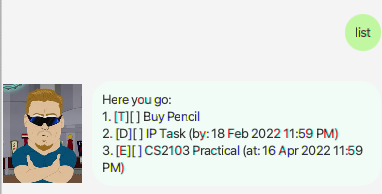
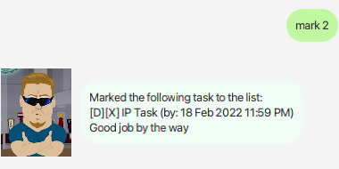
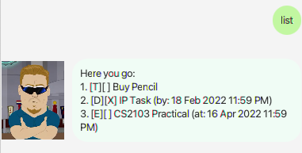
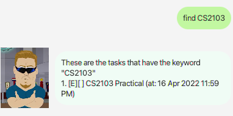
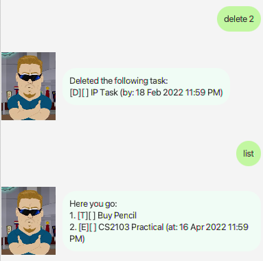

# User Guide

PCPrincipal is a **task storing management system** with marking/unmarking featurefor all tasks.

## Get Started

Download [PCPrincipal.jar](https://github.com/Denniszedead/ip/releases/download/v3.0/duke-v3.0.jar) into your PC and click on it to start PC Principal.

Note:
- There will be a new ``data/duke.txt`` file created where you store PCPrincipal to store all tasks in the task list.

## Features

Note:
- The commands can be in all uppercase, lowercase ora mixture of both.
- The date for ``Deadline`` and ``Event`` must be in this format: ``DD/MM/YYYY HHmm``. E.g: ``1/1/2020 2359``
- Note that only each task (Mainly ``Deadline`` and ``Event``) have a unique date. I.e. no two tasks should have the same date.

### ``Help``: Displays all commands

- Displays all commands available by PCPrincipal.

Expected outcome:

### ``Todo <Task name>``: Add a Todo

- Adds a new todo with the name `<Task name>` into the task list.
- Example:
``Todo Buy Pencil``

Expected outcome:

### ``Deadline <Task name> /by DD/MM/YYYY HHmm``: Adds a deadline

- Adds a new deadline with the name `<Task name>` with the deadline `DD/MM/YYYY HHmm` into the list. 
- Example: ``deadline IP Task /by 18/2/2022 2359``

Expected outcome:

### ``Event <Task name> /at DD/MM/YYYY HH mm``: Adds an event

- Adds a new event with the name `<Task name>` with the event date `DD/MM/YYYY HHmm` into the list.
- Example: ``event CS2103 Practical /at 16/4/2022 2359``

Expected outcome:

### ``List``: Shows all the task

- Shows all the tasks in the task list.

Expected outcome:

### ``Mark <index number>``: Marks tasks

- Marks the task in index `index number` of the task list. 
- Example: ``mark 2``

Initial Outcome:

Expected Outcome:

### ``Unmark <index number>``: Unmarks tasks

- Unmarks the task in index `index number` of the task list. 
- Example: ``Unmark 2``

Initial Outcome:

Expected Outcome:

### ``Find <Keyword>``: Finds all tasks with the keyword

- Finds all the tasks which contains `keyword`. 
- Example: ``Find CS2103``

Expected Outcome:

### ``Deletes <index number>``: Deletes tasks

- Deletes the task in index `index number` of the task list. 
- Example: ``Delete 2``

Initial Outcome:

Expected Outcome:

### ``Bye``: Exits PCPrincipal

PCPrincipal will exit.