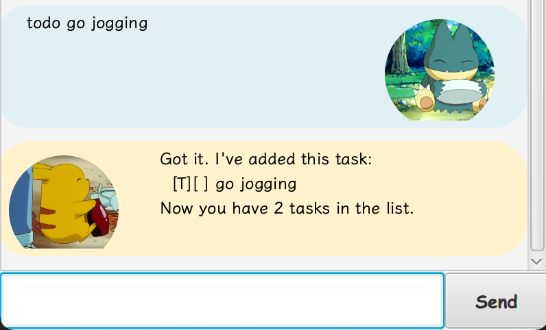
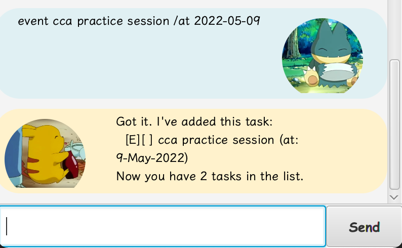
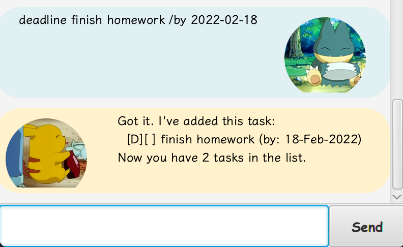
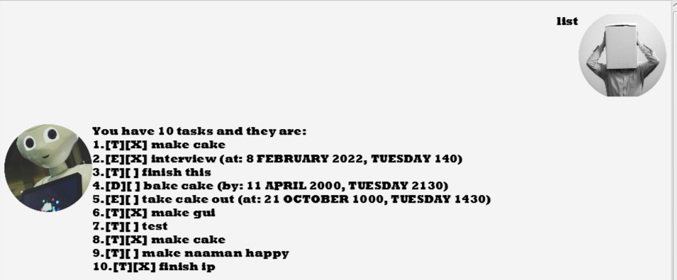
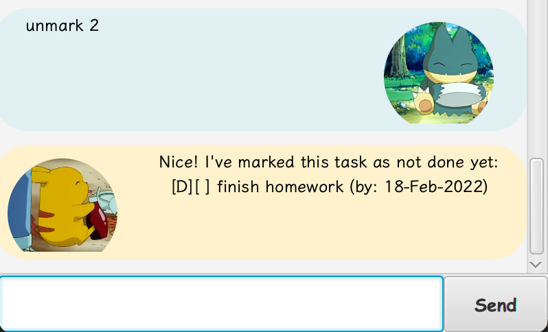

# User Guide

## Quick Start
1. Ensure you have Java `11` or above installed in your Computer.
2. Download the latest 'duke.jar' from [here](https://github.com/LapisRaider/ip/releases).
3. Copy the file to the folder you want to use as the home folder for your duke.
4. To start the application can either:
   * Double-click the file to start the app. OR
   * Open command prompt in the folder with `duke.jar` and run `java -jar duke.jar`.
5. Type the proper command format according to the specifications.

---
## Feature Summary
| Feature  | Description                                 | Format                                |
|----------|---------------------------------------------|---------------------------------------|
| help     | Show a list of available commands for Duke. | `help`                                |
| todo     | Adds a todo task in the todolist.           | `todo DESCRIPTION`                    |
| event    | Adds an event task in the todolist.         | `event DESCRIPTION /at DATE [TIME]`   |
| deadline | Adds a deadline task in the todolist.       | `deadline DESCRIPTION /at DATE [TIME]`|
| list     | Lists all the tasks.                        | `list`                                |
| delete   | Delete a task from the tasklist.            | `delete TASK_INDEX`                   |
| find     | Find tasks by a given keyword.              | `find KEYWORD`                        |
| mark     | Mark task as done.                          | `mark TASK_INDEX`                     |
| unmark   | Unmark task as done.                        | `unmark TASK_INDEX`                   |
| bye      | Close the application.                      | `bye`                                 |

---
## Usage 

**Notes about the command format:**
* Words in `UPPER_CASE` are the parameters to be supplied by the user.  
  e.g. in `todo DESCRIPTION`, `DESCRIPTION` is a parameter which can be used as `todo homework`.
* Items in square brackets are optional.  
  e.g. in `deadline DESCRIPTION /by DATE [TIME]` can be used as `deadline work /by 2022-12-12` or as 
  `deadline work /by 2022-12-12 2359`
* Extraneous parameters for commands that do not take in parameters
 (such as `help`, `list`, `bye`) will be ignored.  
 e.g. if the command specifies `help 123`, it will be interpreted as `help`.

---
### Viewing help : `help`
Show a list of available commands for Duke.

**Format**: `help`

**Expected outcome:**  

---
### Add todo task : `todo`
Adds a todo task in the todolist.

**Format:** `todo DESCRIPTION` 

**Example:**
* `todo run 15km`

**Expected outcome:**  

---
### Add event task: `event`
Adds an event task in the todolist. Not putting `TIME` will give it a default time of 11.59pm.

**Format:** `event DESCRIPTION /at DATE [TIME]`  
Format of `DATE`: `yy-mm-dd`  
Format of `TIME`: `hhmm` 

**Example:** 
* `event Swim meet /at 2022-02-18`,
* `event Swim meet /at 2022-02-18 1520`

**Expected outcome:**  

---
### Add deadline task: `todo`
Adds a deadline task in the todolist. Not putting `TIME` will give it a default time of 11.59pm.

**Format:** `deadline DESCRIPTION /at DATE [TIME]`  
Format of `DATE`:  `yyyy-mm-dd`  
Format of `TIME`: `hhmm` 

**Example:**
* `deadline Finish CS3240 assignment /by 2022-02-18`, 
* `deadline Finish CS3240 assignment /by 2022-02-18 1520`

**Expected outcome:**  

---
### List all tasks: `list`
Lists all the tasks.

**Format:** `list` 

**Expected outcome:**  

---
### Delete a task: `delete`
Delete a task from the tasklist.

**Format:** `delete TASK_INDEX` 
`TASK_INDEX` format: Has to be a number, it's respective to the ordering shown in the tasklist from `list` command.

**Example of usage:** 
* `delete 2`

**Expected outcome:**  

---
### Find tasks by keyword: `find`
Find tasks by a given keyword. The keyword is not case-sensitive. It will be able to find tasks
even if the keyword is partially written.

**Format:** `find KEYWORD`

**Example:** 
* `find assignment`
* `find assign`

**Expected outcome:**  

---
### Mark tasks as done: `mark`
Mark task as done.

**Format:** `mark TASK_INDEX`  
`TASK_INDEX` format: Has to be a number, it's respective to the ordering shown in the tasklist 
from `list` command.  

**Example:** 
* `mark 1`
* `mark 2`

**Expected outcome:**  

---

### Unmark tasks as undone: `unmark`
Unmark task as undone.

**Format:** `unmark TASK_INDEX`  
`TASK_INDEX` format: Has to be a number, it's respective to the ordering shown in the tasklist
from `list` command.

**Example:** 
* `unmark 1`, 
* `unmark 2`

**Expected outcome:**  

---

### Exiting the program: `bye`
Closes the application.

**Format:** `bye` 

**Expected outcome:**  

---

### Saving the data
Tasklist data are saved in the hard disk automatically after any command that changes the data. 
There is no need to save manually.

### Editing the data file
Tasklist data are saved as a txt file `[Duke JAR file location]/data/data.txt`

**CAUTION:** If your changes to the data file makes its format invalid, Duke will discard all data 
and start with an empty data file at the next run.
