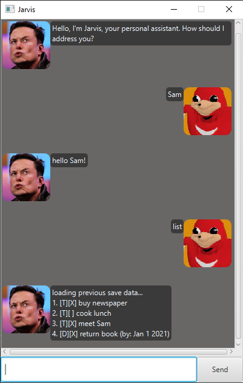
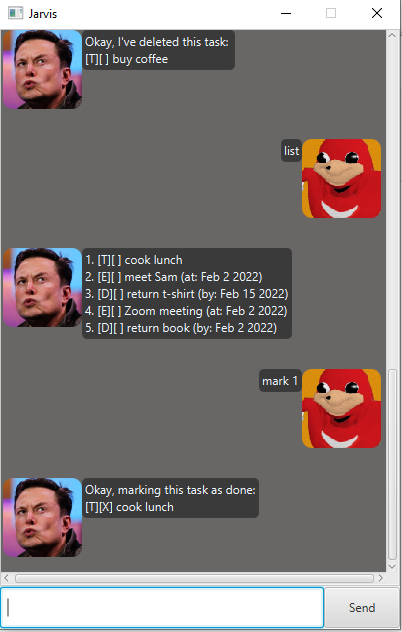
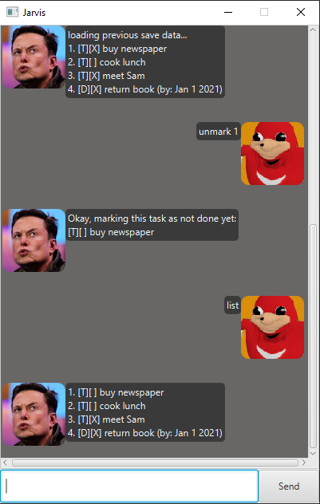
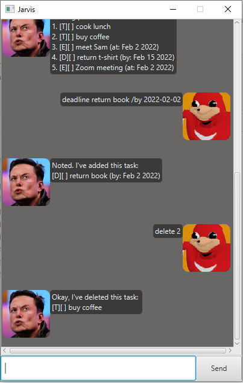
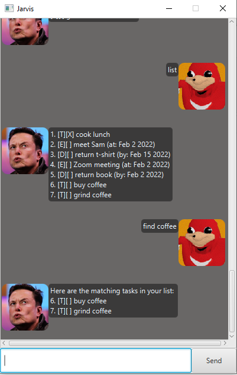

# User Guide for Jarvis 



## Features

### Task Reminders

Jarvis will intelligently check for any overdue & upcoming tasks & remind you accordingly! A separate dialog box will appear listing these overdue & upcoming tasks.

Jarvis is also intelligent to check against the latest Task List & include in the reminder any newly added Tasks that are overdue or upcoming!

.PNG) 

.PNG)


## Usage

### `todo` - Create a ToDo task.

Creates a ToDo task that is stored in the local Task List & saved to the drive.

Example of usage:

`todo buy coffee`

Expected outcome:

```
Noted. I've added this task: 
[T][ ] buy coffee 
```


### `event TASK_DESCRIPTION /at EVENT_DATE` - Create an Event task.

Creates an Event task that is stored in the Local Task List & saved to the drive.

Example of usage:

`event Zoom meeting /at 2022-02-02`

Expected outcome:

```
Noted. I've added this task: 
[E][ ] meet Sam (at: Feb 2 2022) 
```


### `deadline TASK_DESCRIPTION /by DUE_DATE` - Create a Deadline task.

Describe the action and its outcome.

Example of usage:

`deadline return book /by 2022-02-02`

Expected outcome:

```
Noted. I've added this task:
[D][ ] return book (by: Feb 2 2022) 
```


### `mark/unmark TASK_INDEX`- Mark/Unmark a Task as done/not done.

Marks/Unmarks a task as done/not done accordingly. Its status is accordingly updated in the local Task List & is saved to the drive as so. Note you cannot mark/unmark a task index that is not in the current Task List!

Example of usage:

`mark 1`
`unmark 1`

Expected outcome:

```
Okay, marking this task as done:
[T][X] cook lunch 
```



```
Okay, marking this task as not done yet:
[T][ ] buy newspaper
```



### `delete TASK_INDEX`  - Delete a Task

Describe the action and its outcome.

Example of usage:

`delete 2`

Expected outcome:

```
Okay, I've deleted this task:
[T][ ] buy coffee 
```


### `find TASK_DESCRIPTION` - Delete a Task

Helps you find Tasks matching the specified `TASK_DESCRIPTION`. This list of tasks will include the tasks’ original index in the Task List, so that you can easily find the specific task using the task index.

Example of usage:

`find coffee`

Expected outcome:

```
Here are the matching tasks in your list:
6. [T][ ] buy coffee
7. [T][ ] grind coffee
```
