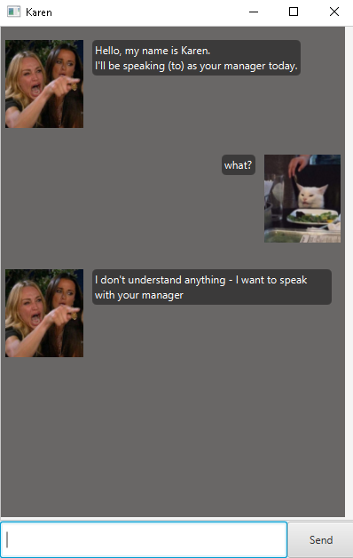

# User Guide for Karen



Ever wanted someone to breathe down your neck and pressure you to manage your tasks?

With **Karen**, you can do just so!

## Features 

### Your Task Manager

You can add the following tasks for Karen to keep track!

* **ToDo**
* **Deadline**
* **Event**

### Saves your tasks

Karen will save your tasks over time into `./data/karen.txt`. 

---

## Usage

### `list` - Lists all Tasks stored 

List all Tasks stored in `./data/karen.txt`

**Example of usage:** 

`list`

**Expected outcome:**

If no tasks are currently stored:
```Nothing is even added yet.```

If a task is added to Karen.
``` 1. [T][ ] add description ```

<br>

### `todo <description>` - Adds a Todo

Adds a Todo that will be stored in Karen.

**Example of usage:**

`todo add description`

**Expected outcome:**
```
Fine. Task added:
 [T][ ] add description
Now you have 1 in total.
```
<br>

### `deadline <description> /by <datetime>` - Adds a Deadline

Adds a Deadline that will be stored in Karen.
`<datetime>` is to be added in `yyyy-mm-dd HHmm` format

**Example of usage:**

```
deadline add description /by 2021-01-01 1800
```

**Expected outcome:**

```
Fine. Task added:
 [D][ ] add description (by: 2021-01-01 06:30PM) 
Now you have 1 in total.
```
<br>

### `event <description> /at <datetime>` - Adds an Event

Adds an Event that will be stored in Karen.
`<datetime>` is to be added in `yyyy-mm-dd HHmm` format

**Example of usage:**

```
event add description /at 2021-01-01 1800
```

**Expected outcome:**

```
Fine. Task added:
 [E][ ] add description (at: 2021-01-01 06:30PM) 
Now you have 1 in total.
```

### `delete <index>` - Deletes Task

Deletes Task from Karen at index.

**Example of usage:**

```
delete 0
```

**Expected outcome:**

```
Fine. Task removed:
 [T][ ] add description
Now you have 0 in total.
```

<br>

### `delete <index>` - Deletes Task

Deletes Task from Karen at index.

**Example of usage:**

```
delete 0
```

**Expected outcome:**

```
Fine. Task removed:
 [T][ ] add description
Now you have 0 in total.
```

<br>

### `mark/unmark <index>` - Marks Task as done or undone

Marks or unmarks a Task as done or undone

**Example of usage:**

```
mark 1
unmark 1
```

**Expected outcome:**

```
This task is finally done:
 [T][X] add description
```

```
This task is now incomplete - unacceptable:
 [T][ ] add description
```

<br>

### `edit <index> /description <editDescription>` - Edits description of Task

Edits the description of a Task currently stored in Karen.

**Example of usage:**

```
edit 1 /description change description
```

**Expected outcome:**

```
Fine. Task edited, looks like this now:
 [T][ ] change description
```

<br>

### `find <keyWord>` - Finds Task that has description `keyword`

Finds Task with description that is the same as the matching keyWord.

**Example of usage:**

```
find add description
```

**Expected outcome:**

```
You made me find just to get this:
 [T][ ] add description
```

<br>

### `bye` - Exits 

To exit the program

**Example of usage:**

```
bye
```

**Expected outcome:**

```
Goodbye. I'll be seeing your manager's manager next.
I'll remember this.
```
