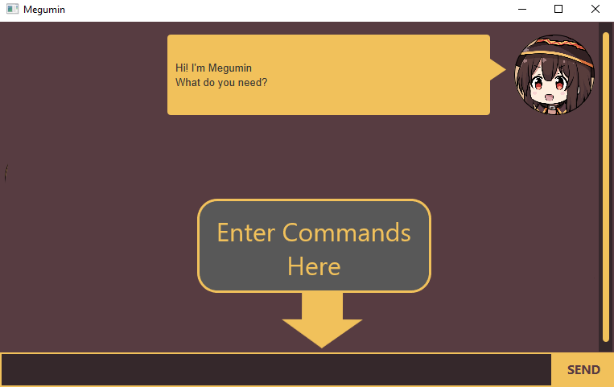
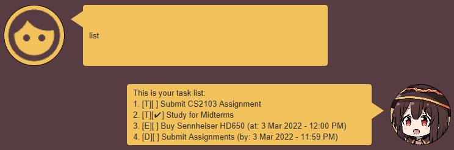
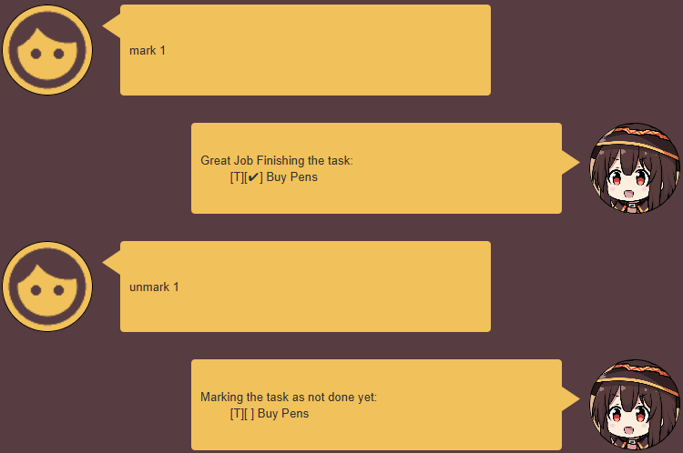

# User Guide
Megumin is a **personal assistant chatbot** for helping you **manage the tasks you need to do**. The desktop application is packaged with a familiar **messenger-like Graphical User Interface (GUI)** for an intuitive experience. Simply chat with Megumin to get started!

- [Quick Start](#quick-start)
- [`bye` Command](#bye---exiting-the-application)
- [`list` Command](#list---listing-all-tasks)
- [`find` Command](#find---finds-tasks-with-keyword)
- [`mark`/`unmark` Command](#markunmark---set-the-completion-status-of-tasks)
- [`todo` Command](#todo---creates-a-basic-todo-type-task)
- [`deadline` Command](#deadline---creates-a-deadline-type-task)
- [`event` Command](#event---creates-a-event-type-task)
- [`delete` Command](#delete---deletes-a-task)
- [`upcoming` Command](#upcoming---lists-the-tasks-in-the-next-n-days)
- [`schedule` Command](#schedule---lists-the-tasks-on-a-date)
- [`between` Command](#between---lists-the-tasks-between-2-date-times)

## Quick Start
1. Check that you have a working installation of Java 11. If not, you can download OpenJRE 11 [here](https://openjdk.java.net/projects/jdk/11/).
2. Download the latest JAR release of Megumin from the GitHub project [release page](https://github.com/sharpstorm/ip/releases).
3. Double click the JAR file to start. Please note that the application requires read/write access to the directory it is run in.

## Features 

### Task Tracking

Megumin will keep track of all your tasks for you! Add, Remove, Edit and View all the tasks that you have asked Megumin to remember. You can also tell Megumin that you have completed a task, and Megumin will mark that task as done in her memory.

### Dated Tasks

You can also add tasks with a date associated to them. If you ask Megumin for tasks within a specific range, Megumin will intelligently show you only the relevant tasks that you ask for.

### Search by Keyword

Have a long list of tasks? You can tell Megumin roughly what the task is about, and Megumin will search through your list and find the relevant ones.

### Long-Term Storage

Megumin will remember your tasks across multiple runs, so you can be assured that even if you forget what you need to do, Megumin won't.

### Natural Date Processing

Telling bots a date and time can be difficult! Thats why Megumin understands natural date formats so you can simply type the dates you want as if you are speaking.

## Usage

For all commands listed below, type them into the chatbox and either press send or hit enter.

### Date and Date-Time formatting

For all commands that require a Date or Date-Time, you can provide the date component in any of the following formats.

| Format Type         | Syntax     | Example |
|---------------------|------------|---------|
| Standard Format     | `dd-mm-yyyy` or `dd/mm/yyyy` | `23-11-2022` `24/12/2022` |
| Day-Relative Format | `next [X-day]` | `next monday` `next tue` `next friday` |
| Natural Format      | `dd [Natural Month] yyyy`  in any order | `12 Jan 2022` `22 December 2023` `2024 Feb 24` `April 2025 1` |
| Relative Format     | `[today / tomorrow]` or  `dd [this/next] month` or  `dd [Natural Month] [this/next] year` | `today` `15 this month` `30 next month` `14 Feb next year` `25 december this year` |

If a time component is required, it time component must strictly follow the format:
> `hh:mm` in 24-hour format

For example, `13:40` represents `1:40 PM`.
There is some flexibility if either the hour or minute component is only a single digit: `5:5` represents `5:05 AM`

### `bye` - Exiting the Application

Tell Megumin `bye` to close the application.

### `list` - Listing All Tasks

Shows all the tasks that you have told Megumin.

| **Syntax** | `list` |
|------------|--------|
| No Arguments | |

#### Expected Outcome

Megumin shows you the list of tasks that is currently being remembered.

### `find` - Finds Tasks with Keyword

Shows all the tasks which contain the keyword provided in their descriptions.

| **Syntax** | `find [KEYWORD]` |
|------------|--------|
| KEYWORD | The search term that Megumin should find in task descriptions.  Keyword matching is **Case-Insensitive**. |

#### Example Usage
- `find Buy` : Shows all the tasks that contain the word `buy`
- `find BuY` : Shows all the tasks that contain the word `buy`

#### Expected Outcome

Megumin shows you the list of tasks that have a matching description

### `mark`/`unmark` - Set the Completion Status of Tasks

Tell Megumin to mark a task as either done or undone. 
`mark` sets the task to done, while `unmark` sets the task to not done.

| **Syntax** | `mark [TASK NUMBER]` or `unmark [TASK NUMBER]` |
| - | - |
| TASK NUMBER | The ID of the task to mark or unmark, as shown in the `list` command |

#### Example Usage
- `mark 1` : Marks the first task in the list as completed
- `unmark 2` : Marks the second task in the list as not done

#### Expected Outcome
Megumin marks the selected task as done or not done, depending on the command issued.

### `todo` - Creates a Basic Todo Type Task

Creates a simple Todo task with a description and completion status.

| **Syntax** | `todo [TASK DESCRIPTION]` |
| - | - |
| TASK DESCRIPTION | A textual description of the task to be created |

#### Example Usage
- `todo Buy even more pens!` : Creates a Todo Task with the description `Buy even more pens!`
- `todo Submit Assignment` : Creates a Todo Task with the description `Submit Assignment`

#### Expected Outcome
Megumin creates a new Todo Task with the provided description.

### `deadline` - Creates a Deadline Type Task

Creates a Deadline task with a description, do-by-date and completion status.

| **Syntax** | `deadline [TASK DESCRIPTION] /by [DATE-TIME]` |
| - | - |
| TASK DESCRIPTION | A textual description of the task to be created |
| DATE-TIME | The date and time associated with the deadline.   See [Date-Time Formats](#date-and-date-time-formatting) for more information on the accepted formats. |

#### Example Usage
- `deadline Buy even more pens! /by next tue 12:00` : Creates a Deadline Task with the description `Buy even more pens!` which needs to be done by `next tuesday, 12 PM`
- `deadline Submit Assignment /by 13 Jan 2023 23:59` : Creates a Deadline Task with the description `Submit Assignment` which needs to be done by `13 Jan 2023, 11:59 PM`

#### Expected Outcome
Megumin creates a new Deadline Task with the provided description and date.

### `event` - Creates a Event Type Task

Creates an Event task with a description, a happening-on date and completion status.

| **Syntax** | `event [TASK DESCRIPTION] /at [DATE-TIME]` |
| - | - |
| TASK DESCRIPTION | A textual description of the task to be created |
| DATE-TIME | The date and time associated with the event.   See [Date-Time Formats](#date-and-date-time-formatting) for more information on the accepted formats. |

#### Example Usage
- `event Buy even more pens! /at next tue 12:00` : Creates an Event Task with the description `Buy even more pens!` which is happening on `next tuesday, 12 PM`
- `event Submit Assignment /at 13 Jan 2023 23:59` : Creates an Event Task with the description `Submit Assignment` which is happening on `13 Jan 2023, 11:59 PM`

#### Expected Outcome
Megumin creates a new Event Task with the provided description and date.

### `delete` - Deletes a Task

Deletes a task from the list of tasks.

| **Syntax** | `delete [TASK NUMBER]` |
| - | - |
| TASK NUMBER | The ID of the task to mark or unmark, as shown in the `list` command |

#### Example Usage
- `delete 3` : Deletes the task at index 3 in the task list.
- `delete 1` : Deletes the first task in the task list.

#### Expected Outcome
Megumin deletes the task at the given position.

### `upcoming` - Lists the Tasks in the Next N-Days

Lists all the tasks in the upcoming N-Days.

| **Syntax** | `upcoming [NUMBER OF DAYS]` |
| - | - |
| NUMBER OF DAYS | Number of days ahead of today to include in the output |

#### Example Usage
- `upcoming 3` : Lists all tasks in the next 3 days.
- `upcoming 365` : Lists all the tasks in the next year.

#### Expected Outcome
Megumin shows all the tasks that have a date that falls within the next N-Days.

### `schedule` - Lists the Tasks on a Date

Lists all the tasks happening on the specified date.

| **Syntax** | `schedule [DATE]` |
| - | - |
| DATE | The date to list.   See [Date Formats](#date-and-date-time-formatting) for more information on the accepted formats. |

#### Example Usage
- `schedule next tue` : Lists all tasks in the next 3 days.
- `schedule 14 Feb next year` : Lists all the tasks in the next year.

#### Expected Outcome
Megumin shows all the tasks that are happening on the specified date.

### `between` - Lists the Tasks Between 2 Date-Times

Lists all the tasks happening between 2 date-times.

| **Syntax** | `between [DATE-START] and [DATE-END]` |
| - | - |
| DATE-START | The starting date-time of the window to list.   See [Date-Time Formats](#date-and-date-time-formatting) for more information on the accepted formats. |
| DATE-END | The ending date-time of the window to list. |

#### Example Usage
- `between next mon 12:00 and 13 next month 12:00` : Lists all tasks between next monday, 12 PM and the 13th of next month, 12 PM.
- `between today 12:00 and 24 Dec next year 12:00` : Lists all the tasks between today, 12 PM and the 24th of December next year, 12PM.

#### Expected Outcome
Megumin shows all the tasks that are happening between the two specified dates.

