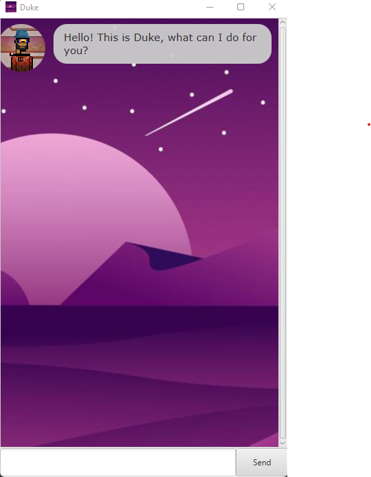

# User Guide

Duke is an application that assists you in managing your current task at hand, optimized for use via
Command Line Interface (CLI). Duke will be able to manage your tasks faster than traditional GUI apps, provided that
you can type fast.

- Quick Start
- Features
  - Adding a todo task: `todo`
  - Adding a deadline task: `deadline`
  - Adding an event task: `event`
  - Deleting a task: `delete`
  - Listing all events: `list`
  - Marking a task as completed: `mark`
  - Marking a task as incomplete: `unmark`
  - Finding a task: `find`
  - Displaying all available commands: `help`
  - Exiting the program: `bye`
  - Saving the data
- Command Summary

## Quick Start
1. Ensure that you have Java `11` or above installed in your Computer.
2. Download the latest `duke.jar` from [here.](https://)
3. Copy the file to the folder you want to use as the *home folder* for your Duke.
4. Double-click the file to start the app. The GUI similar to the below should appear in a few seconds.



5. Type the command in the command box and press Enter to execute it. eg. typing `help` and pressing Enter
will show you a list of available commands.<br>Some example commands you can try:

   - `list`: Lists all tasks.
   - `todo buy groceries`: Adds a `todo` task with the description *buy groceries*.
   - `delete 3`: Deletes the third task in the list.
   - `bye`: Exits the program.

6. Refer to the Usage below for details of each command.

## Usage

### `todo` - Adds a Todo task
Adds a Todo task to the task list.

Format: `todo [TASK_DESCRIPTION]`

Example: `todo buy groceries`

Expected outcome:
```
Duke:

Got it, I have added buy groceries to the list!
[T][] buy groceries
Now you have 1 tasks in the list. 
```
### `deadline` - Adds a Deadline task
Adds a Deadline task to the task list.

Format: `deadline [TASK_DESCRIPTION] /by [DATE]`

- Date must be in `yyyy-mm-dd` format.

Example: `deadline tutorial assignment /by 2022-02-20`

Expected outcome:
```
Duke:

Got it, I have added tutorial assignment to the list!
[D][] tutorial assignment (by: Feb 20 2022)
Now you have 2 tasks in the list. 
```
### `event` - Adds an Event task
Adds an Event task to the task list.

Format: `event [TASK_DESCRIPTION] /at [DATE]`

- Date must be in `yyyy-mm-dd` format.

Example: `event birthday party /at 2022-02-20`

Expected outcome:
```
Duke:

Got it, I have added birthday party to the list!
[E][] birthday party (at: Feb 20 2022)
Now you have 3 tasks in the list. 
```
### `delete` - Deletes a task
Deletes a task from the task list.

Format: `delete [ITEM NO.]`

- Delete the task at the specified `[ITEM NO.]`
- The item number refers to the number shown in the displayed tasks list.
- The item number **must be a positive integer** 1, 2, 3,

Example: `delete 1`

Expected outcome:
```
Duke:

Noted. I've removed this task:
[T][] buy groceries
Now you have 2 tasks in the list. 
```
### `list` - Lists all task in the task list
Lists all tasks in the task list.

Format: `list`

Example: `list`

Expected outcome:
```
Duke:

Here are the task in your list:
1. [T][X] buy groceries
2. [D][] tutorial assignment (by: Feb 20 2022)
```
### `mark` - Marks a task as completed
Marks a task from the task list as completed.

Format: `mark [ITEM NO.]`

- Marks the task at the specified `[ITEM NO.]`
- The item number refers to the number shown in the displayed tasks list.
- The item number **must be a positive integer** 1, 2, 3,

Example: `mark 1`

Expected outcome:
```
Duke:

Nice! I've marked this task as done:
[T][X] buy groceries
```
### `unmark` - Marks a task as incomplete
Marks a task from the task list as incomplete.

Format: `unmark [ITEM NO.]`

- Unmarks the task at the specified `[ITEM NO.]`
- The item number refers to the number shown in the displayed tasks list.
- The item number **must be a positive integer** 1, 2, 3,

Example: `unmark 2`

Expected outcome:
```
Duke:

OK, I've marked this task as not done yet:
[D][] tutorial assignment (by: Feb 20 2022)
```
### `find` - Find a specific task from the list
Finds a task from the task list.

Format: `find [KEYWORD]`

- Lists all tasks that contains the `[KEYWORD]`

Example: `find party`

Expected outcome:
```
Duke:

Here are the matching tasks in your list:
[E][X] birthday party
[E][] new year's eve party
```
### `help` - Lists all available commands
Shows a list of all available commands

Format: `help`

Example: `help`

Expected outcome:
```
Duke:

Here are the list of commands that you can use:
todo: Create a task eg. (todo homework)
event: Create an event that has a starting date eg. (event Birthday Party /at 2022-04-04)
deadline: Create an event with a deadline eg. (deadline Submit assignment /by 2022-02-18)
list: List all the current tasks that you have
delete [ITEM NO.]: Delete a task that is no longer needed in the list eg. (delete 2)
mark/unmark [ITEM NO.]: Mark or unmark a task that is completed in the list eg. (mark 2)
find [KEY]: Find a task in the list corresponding to the keyword eg. (find homework)
bye: Exits the application";
```
### `bye` - Exits the program
Exits the program

Format: `bye`

Expected outcome:
```
Duke:

Good bye!
```
### Saving the data
Duke's data are saved in the same folder duke was running in. Any command that changes the data will be saved
automatically, there is no need to save manually.

### Command Summary
|Action  |Format, Examples|
|--------|----------------|
|todo    |`todo buy groceries`|
|event   |`event birthday party /at 2022-02-20`|
|deadline|`deadline tutorial assignment /by 2022-02-20`|
|delete  |`delete 2`|
|list    |`list`|
|mark    |`mark 1`|
|unmark  |`unmark 2`|
|find    |`find party`|
|help    |`help`|
|bye     |`bye`|