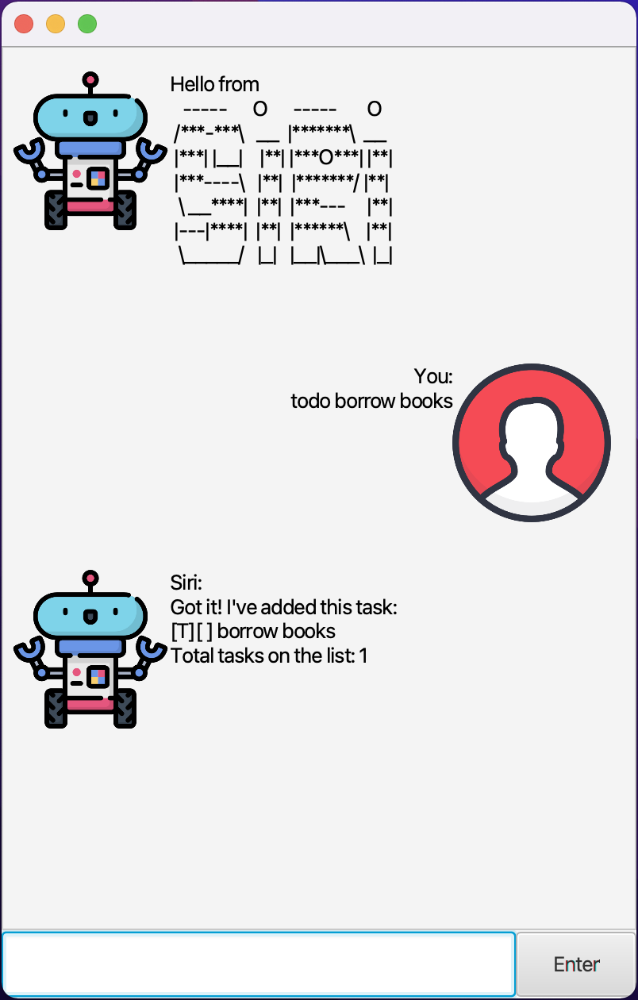
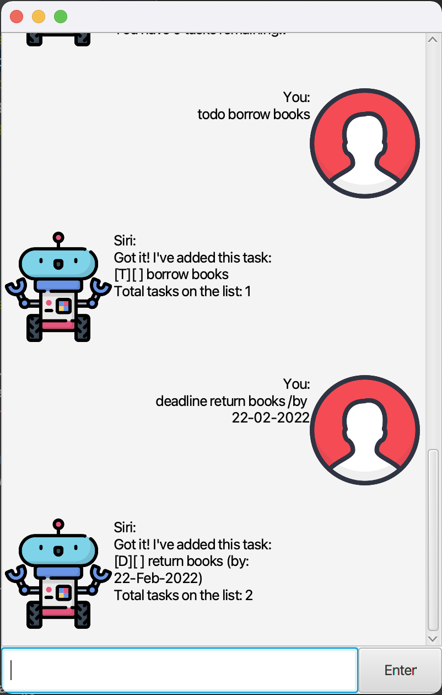
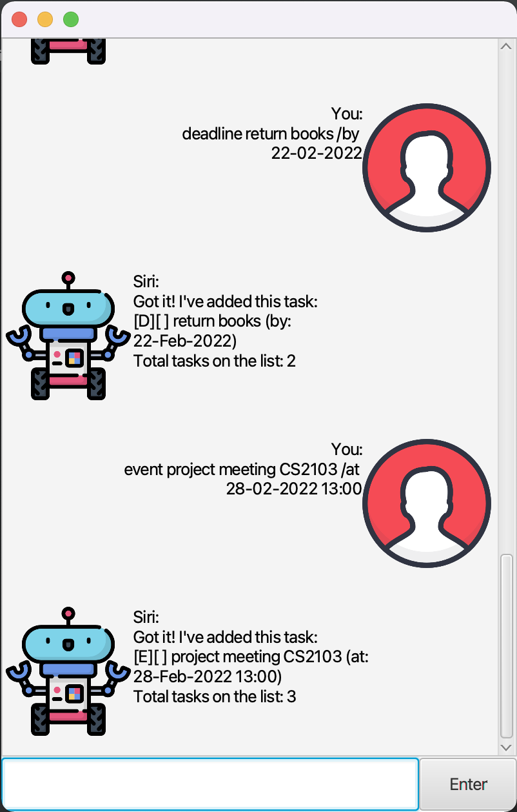
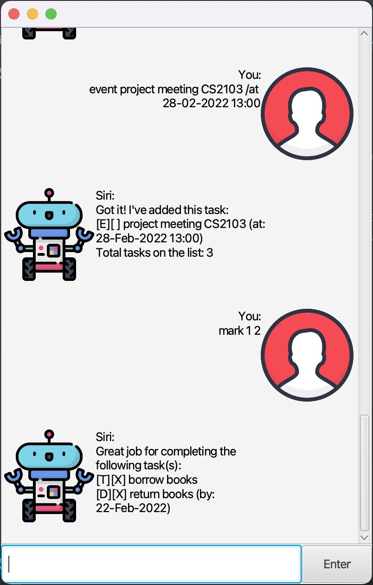
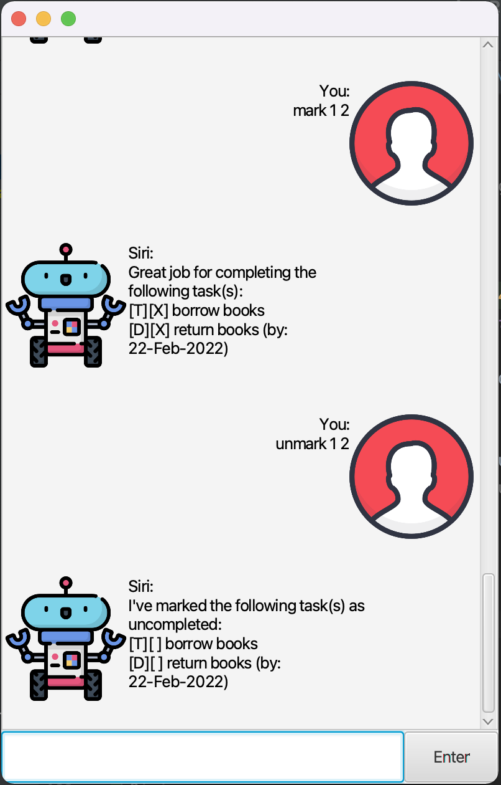
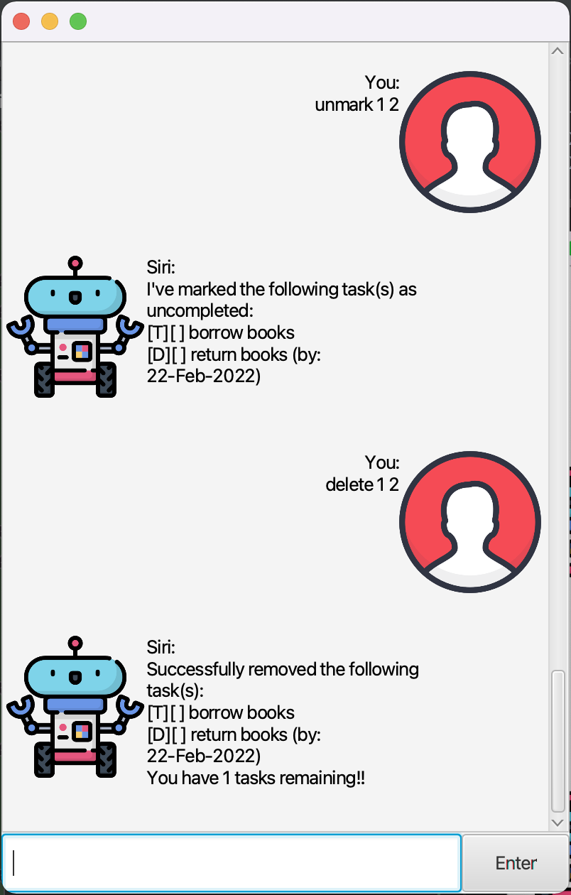
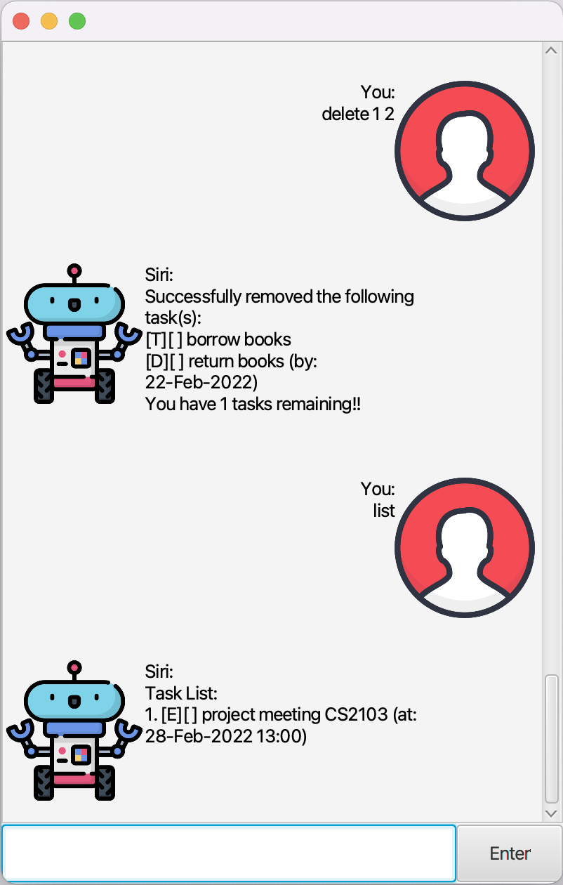
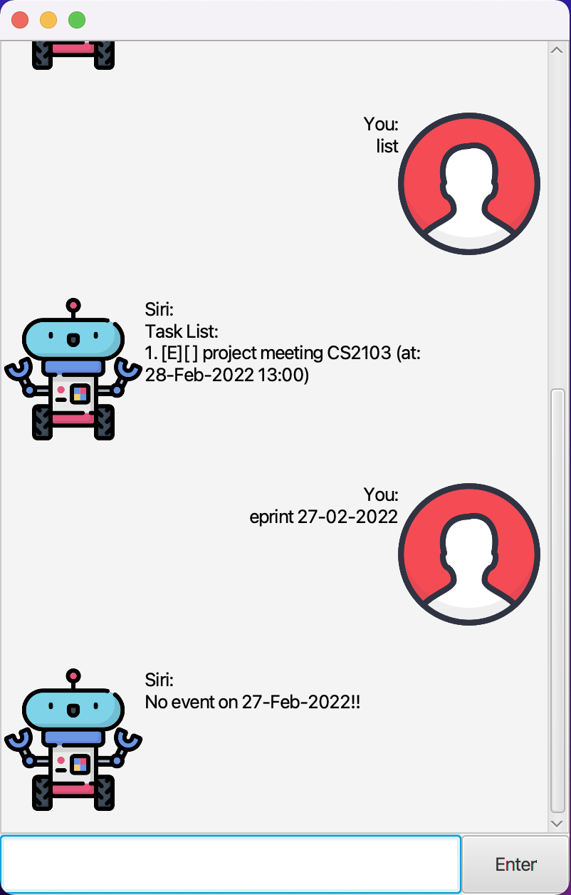
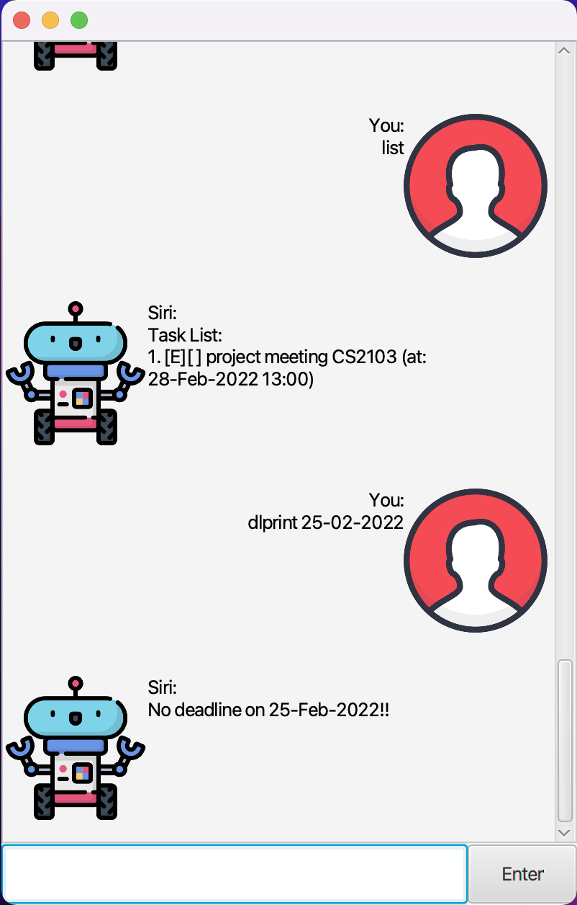

[](https://github.com/lamwj98/ip)
# User Guide
~~Duke~~ _**Siri**_ is a todo list chatbot that helps you track your day to day tasks so that you can send more brain power on place where it better fits.

## Getting Siri
You can get Siri by downloading the latest version of _**Siri**_ .jar file under releases.

As _**Siri**_ is developed under JDK 11, it is recommended that you have Java SE 11 or later installed on your computer before running _**Siri**_.

___

## Features
As of the current versions the following features are available for users.

- [x] Add tasks
- [x] Delete tasks
- [x] Mark tasks done
- [x] Mark tasks undone
- [x] List tasks

### Types of tasks keep tracked in Siri
- `todo` (task with no date or time field)
- `deadline` (task with compulsory date field and optional time field)
- `event` (task with compulsory date and time field)
___

## Usage

### `todo` - adding a todo task

To add a todo task, simply chat with _**Siri**_ by entering `todo <task name>`. By doing so, Siri will add the <task name> to the todo list.

Example of usage:

```
todo borrow books
```

Expected outcome:

```
Siri:
Got it! I've added this task:
[T][] borrow books
Total tasks on the list: 1
```


### `deadline` - adding a deadline task

To add a deadline task, simply chat with _**Siri**_ by entering `todo <task name> /by <date> <time>`. By doing so, Siri will add the `<task name>` to the todo list.

**IMPORTANT**: 
- `<date>` enter must be in `dd-mm-yyyy` format, for example, ``22-02-2022`` to symbolist _**22 Febuary 2022**_. 
- `<time>` is optional for deadline task however, if it is to be entered, it must be in `hh:mm` format, for example, ``15:00`` to symbolist _**3pm**_ in the late afternoon.

Example of usage:

```
deadline return books /by 22-02-2022
```

Expected outcome:

```
Siri:
Got it! I've added this task:
[D][] return books (by: 22-Feb-2022)
Total tasks on the list: 2
```


### `event` - adding an event task

To add a deadline task, simply chat with _**Siri**_ by entering `event <task name> /at <date> <time>`. By doing so, Siri will add the `<task name>` to the todo list.

**IMPORTANT**:
- `<date>` enter must be in `dd-mm-yyyy` format, for example, ``22-02-2022`` to symbolist _**22 Febuary 2022**_.
- `<time>` enter must be in `hh:mm` format, for example, ``15:00`` to symbolist _**3pm**_ in the late afternoon.

Example of usage:

```
event project meeting CS2103 /at 28-02-2022 13:00
```

Expected outcome:

```
Siri:
Got it! I've added this task:
[E][] project meeting (by: 28-Feb-2022 13:00)
Total tasks on the list: 3
```


### `mark` - marking task(s) done

To mark a task done, simply chat with _**Siri**_ by entering `mark <task number>`. By doing so, Siri will mark the task indicated by the `<task number>` done. This action can be expended to mark multiple tasks at one go with `mark <task number 1> <task number 2> ...`. The ellipsis is used to indicate other tasks' number. Each number must be separated with a _**space**_ ` `.   

**IMPORTANT**:
- `<task number>` indicates the task number on the list.
- Error will be thrown if any `<task number>` is not valid (i.e. out of range).

Example of usage:

```
mark 1 2
```

Expected outcome:

```
Siri:
I've marked the following task(s) as uncompleted:
[T][] borrow books
[D][] return books (by: 22-Feb-2022)
```

### `unmark` - marking task(s) uncompleted

To mark a task as uncompleted, simply chat with _**Siri**_ by entering `unmark <task number>`. By doing so, Siri will mark the task indicated by the `<task number>` as uncompleted. This action can be expended to mark multiple tasks as uncompleted at one go with `unmark <task number 1> <task number 2> ...`. The ellipsis is used to indicate other tasks' number. Each number must be separated with a _**space**_ ` `.

**IMPORTANT**:
- `<task number>` indicates the task number on the list.
- Error will be thrown if any `<task number>` is not valid (i.e. out of range).

Example of usage:

```
unimmark 1 2
```

Expected outcome:

```
Siri:
Great job for completeing the following task(s):
[T][X] borrow books
[D][X] return books (by: 22-Feb-2022)
```


### `delete` - removing task(s) from the todo list

To remove a task from the todo list, simply chat with _**Siri**_ by entering `delete <task number>`. By doing so, Siri will remove the task indicated by the `<task number>`. This action can be expanded to remove multiple tasks at one go with `delete <task number 1> <task number 2> ...`. The ellipsis is used to indicate other tasks' number. Each number must be separated with a _**space**_ ` `.

**IMPORTANT**:
- `<task number>` indicates the task number on the list.
- Error will be thrown if any `<task number>` is not valid (i.e. out of range).

Example of usage:

```
delete 1 2
```

Expected outcome:

```
Siri:
Sucessfully removed the following task(s):
[T][] borrow books
[D][] return books (by: 22-Feb-2022)
You have 1 tasks remaining!!
```


### `list` - listing all tasks on the todo list

To list all the task on the todo list, just pass `list` to _**Siri**_ and it will list out all the tasks you have on hand.

Example of usage:

```
list
```

Expected outcome:

```
Siri:
Task List:
1.[E][] project meeting CS2103 (at: 28-Feb-2022 13:00)
```


### `eprint` - prints all event(s) on a specific date

To list all events task on the todo list on a specific date, simply pass `eprint <date>` to Siri and it will return you a list of event(s) on that specific date you passed.

**IMPORTANT**:
- `<date>` enter must be in `dd-mm-yyyy` format, for example, ``22-02-2022`` to symbolist _**22 Febuary 2022**_.

Example of usage:


```
eprint 27-02-2022
```

Expected outcome:

```
Siri:
No event on 27-Feb-2022!!
```


### `dlprint` - prints all deadline(s) on a specific date

To list all events task on the todo list on a specific date, simply pass `dlprint <date>` to _**Siri**_ and it will return you a list of deadline(s) on that specific date you passed.

**IMPORTANT**:
- `<date>` enter must be in `dd-mm-yyyy` format, for example, ``22-02-2022`` to symbolist _**22 Febuary 2022**_.

Example of usage:


```
dlprint 27-02-2022
```

Expected outcome:

```
Siri:
No dealine on 25-Feb-2022!!
```

### `bye` - save your todo list content locally for future use

To save your content locally and exit the application, simply pass `bye` to _**Siri**_.

Example of usage:
````
bye
````
___

## Authors
- Damith C. Rajapakse - _Module Coordinator_
- Andy Lam Wei Jie - _Developer of Siri_
___

## Acknowledgements
- **Cheng Gang** - [_User Guide references_](https://chenggeng97.github.io/duke/)
- **FlatIcon.com** - [_Icon images used in the project_](https://www.flaticon.com/)
- **Apple** - [_Reusing Apple's product name_](https://www.apple.com/sg/siri/)

All references, images and names used in the project are solely for project use and by no means to confuse consumers with the actual product produced by the owners.


