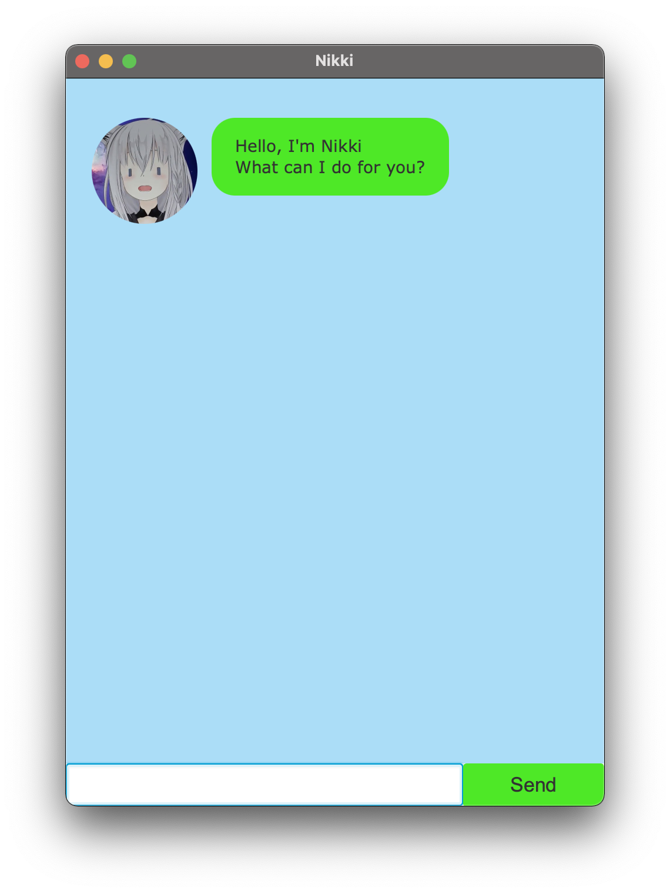

# User Guide

Nikki is a **desktop app for managing tasks**, utilizing a **Command Line Interface (CLI)** for swift operations for
fast typists, while still having a **Graphical User Interface (GUI)** for your task management to be pleasing to the
eye too!

> No more moving your hands to reach for the mouse, everything can be done with you 10 fingers on the keyboard!

 - [Quick start](#quick-start)
 - [Features](#features)
   - [Adding a ToDo: `todo`](#adding-a-todo-todo)
   - [Adding an Event: `event`](#adding-an-event-event)
   - [Adding a Deadline: `deadline`](#adding-a-deadline-deadline)
   - [Listing all tasks: `list`](#listing-all-tasks-list)
   - [Finding a task: `find`](#finding-a-task-find)
   - [Marking a task as done: `mark`](#marking-a-task-as-done-mark)
   - [Marking a task as not done: `unmark`](#unmarking-a-task-as-not-done-unmark)
   - [Deleting a task: `delete`](#deleting-a-task-delete)
   - [Exiting the application: `bye`](#exiting-the-application-bye)
 - [FAQ](#faq)
 - [Summary](#summary)

---

## Quick Start
1. Ensure you have `Java 11` or above installed on your computer. To check so, you may follow the steps below according
   to your OS:

   <details>
     <summary>Windows</summary>
   
   1. In the windows search bar, type in "command prompt" and press Enter.
   2. Type in `java -version` and press `Enter`.
      1. If the version is displayed, this means Java is installed.
      You just need to check whether the *version complies*.
      2. If nothing displays, an error message appears, or your version is incompatible, you may install the correct
      Java version [here](https://www.oracle.com/java/technologies/downloads/#java11).
      
   </details>
      
   <details>
     <summary>MacOS</summary>

   1. Press `cmd + space` to bring up Spotlight Search. Type `terminal` and press `Enter` to open the terminal app.
   2. Type in `java -version` and press `Enter`.
      1. If the version is displayed, this means Java is installed.
         You just need to check whether the *version complies*.
      2. If nothing displays, an error message appears, or your version is incompatible, you may install the correct
         Java version [here](https://www.oracle.com/java/technologies/downloads/#java11).
      
   </details>
   
   <details>
     <summary>Linux</summary>

   1. Open a new terminal window.
   2. Type in `java -version` and press `Enter`.
      1. If the version is displayed, this means Java is installed.
         You just need to check whether the *version complies*.
      2. If nothing displays, an error message appears, or your version is incompatible, you may install the correct
         Java version [here](https://www.oracle.com/java/technologies/downloads/#java11).
      
   </details>
      
2. Download the latest version of `nikki.jar` [here](https://github.com/DavidTan0527/ip/releases/).
3. Copy the file to any folder you want. Note that the application will also store its data in this folder.
4. Double-click to start the app. A window similar to the picture below should pop up.

5. Type each of the following commands in the chat box and press Enter to execute it. Some examples you can try:
   1. `todo buy fruits` : Add a ToDo called "buy fruits"
   2. `todo wash clothes` : Add a ToDo called "wash clothes"
   3. `mark 2` : Mark second task as done
   4. `list` : Show everything in the list
   5. `bye` : Save the list and exit the program
6. Refer to the [Features](#features) section below to learn about more commands.

---

## Features 

### Adding a ToDo: `todo`

Description of the feature.

Example of usage:

`keyword (optional arguments)`

Expected outcome:

Description of the outcome.

```
expected output
```

### Adding an Event: `event`

Description of the feature.

### Adding a Deadline: `deadline`

Description of the feature.

### Listing all tasks: `list`

### Find a task: `find`

### Marking a task as done: `mark`

### Marking a task as not done: `unmark`

### Deleting a task: `delete`

### Exiting the application: `bye`

## FAQ

## Summary
