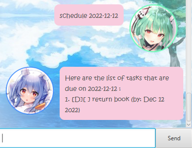

# User Guide

HoloBot is a **desktop app** for managing tasks, optimized for use via a Command Line Interface (CLI) while having the looks of a Graphical User Interface (GUI) application. 

* [Quick Start][1]
* [Features][4]
  *  [Listing all tasks : `list`][5]
  *  [Creating a To-Do Task: `todo`][6]
  *  [Creating a Deadline Task: `deadline`][7]
  *  [Creating an Event Task: `event`][8]
  *  [Marking a task as completed: `mark`][9]
  *  [Unmarking a task: `unmark`][10]
  *  [Deleting a task: `delete`][11]
  *  [Finding a task: `find`][12]
  *  [Listing out tasks scheduled on a particular day: `schedule`][13]
  *  [Exiting HoloBot: `bye`][14]
  *  [Saving and Editing the data file][15]
* [Command Summary][16]

## Quick Start
1. Ensure you have [Java 11][2] or above installed in your computer.
2. Download the latest HoloBot.jar from [here][3].
3. Copy the file to the folder you want to use as the home folder for your HoloBot.
4. Double-click the file to start the app. The GUI similar to the below should appear in a few seconds. 

5. Type the command in the command box and press Enter to execute it. 

Some example commands you can try:

- `list` : Lists all tasks.
- `todo x` : Adds a todo task named `x` to HoloBot.
- `delete 1` : Deletes the 1st task in the current list.
- `bye` : Exits the app.

Refer to the [Features][4] below for details of each command.

## Features 

### Listing all tasks : `list`
Displays a list of tasks that are stored in the data file.

Format: `list`
- Each task is represented as the following: `TASK_INDEX.[TYPE][COMPLETION_STATUS] NAME (ADDITIONAL_DETAILS)`

Usage Example:

### Creating a To-Do Task: `todo`
Creates a new to-do task based on the description that you have specified.

Format: 
- `todo TASK_NAME`
  - This task is unmarked by default (yet to be completed).
  - The task name field cannot be empty.
 
Usage Example: 
- `todo xyz` 
  - Creates a to-do task called `xyz`

### Creating a Deadline Task: `deadline`
Creates a task that has a deadline.

Format: 
- `deadline TASK_NAME /by DATE_IN_YYYY-MM-DD [TIME_IN_HHMM]`
  -  This task is unmarked by default (yet to be completed).
  -  The task name and date fields cannot be empty.
  -  The time field is optional.
  -  The date and time fields cannot be in the past.
  
Usage Example: 
- `deadline x /by 2022-12-12`
  - Creates a deadline task called `x`, and has a deadline by 12/12/2022
- `deadline y /by 2022-12-12 1200`
  - Creates a deadline task called `y`, and has a deadline by 12/12/2022, 12:00pm

### Creating an Event Task: `event`
Creates a event task that has a start date/time.

Format: 
- `event TASK_NAME /at DATE_IN_YYYY-MM-DD [START_TIME_IN_HHMM] [END_TIME_IN_HHMM]`
  -  This task is unmarked by default (yet to be completed).
  -  The task name and date fields cannot be empty.
  -  The starting time and ending time field is optional.
  -  However, the ending time field can only work if the starting time is specified.
  -  The date and time fields cannot be in the past.  
  
Usage Example: 
- `event x /at 2022-12-12`
  - Creates an event task called `x`, which will be held at 12/12/2022
- `event y /at 2022-12-12 1200`
  - Creates an event task called `y`, which will be held at 12/12/2022, 12:00pm
- `event z /at 2022-12-12 1200 1300`
  - Creates an event task called `z`, which will be held at 12/12/2022, from 12:00pm to 1pm

### Marking a task as completed: `mark`
Marks a task with `X` once the task is completed.

Format:
- `mark TASK_INDEX`
  - Marks the task at the specified `TASK_INDEX`. The index refers to the index number shown in the displayed list.
  - The `TASK_INDEX` must be a positive integer and less than/equals to the number of tasks in the list.

Usage Example:
- `mark 1`
  - Marks the first task in the list.

### Unmarking a task: `unmark`
Unmarks a task if the task is not completed.

Format:
- `unmark TASK_INDEX`
  - Unmarks the task at the specified `TASK_INDEX`. The index refers to the index number shown in the displayed list.
  - The `TASK_INDEX` must be a positive integer and less than/equals to the number of tasks in the list.

Usage Example:
- `unmark 1`
  - Unmarks the first task in the list.

### Deleting a task: `delete`
Deletes a task from the data file.

Format:
- `delete TASK_INDEX`
  - Deletes the task at the specified `TASK_INDEX`. The index refers to the index number shown in the displayed list.
  - The `TASK_INDEX` must be a positive integer and less than/equals to the number of tasks in the list.

Usage Example:
- `delete 1`
  - Deletes the first task in the list.
  
### Finding a task: `find`
Finds and lists out tasks that contain the keyword specified.

Format:
- `find SEARCH_SUBSTRING`
  - Finds the task that contain `SEARCH_SUBSTRING` in its name.
  - The find function is case-sensitive. e.g `find abc` will **NOT** match `ABC`
  - Only the name is searched.
  - Only parts of the name needs to match with the `SEARCH_SUBSTRING`. e.g `find ab` will match `abc`

Usage Example:

### Listing out tasks scheduled on a particular day: `schedule`
Finds and lists out tasks that happens/is due on the date specified.

Format:
- `schedule DATE_IN_YYYY-MM-DD`
  - Finds event tasks that were held/is going to be held on the `DATE_IN_YYYY-MM-DD`.
  - Finds deadline tasks that were due/is going to be due on the `DATE_IN_YYYY-MM-DD`.
  - Only the date is searched.

Usage Example:

### Exiting HoloBot: `bye`
Exits the program.

Format:
- `bye`
  - The program will exit automatically, 5 seconds after the exit message is being displayed.

Usage Example:

### Saving and Editing the data file
The data file `data.txt` can be found in the data folder (ip/data).
Advanced users can attempt to edit the data file directly using any text editor.
- **⚠ WARNING**: Ensure that the format of the data is correct!

## Command Summary 

Action | Format, Examples
--------|------------------
**List** | `list`
**Todo** | `todo TASK_NAME`
**Deadline** | `deadline TASK_NAME /by DATE_IN_YYYY-MM-DD [TIME_IN_HHMM]`
**Event** | `event TASK_NAME /at DATE_IN_YYYY-MM-DD [START_TIME_IN_HHMM] [END_TIME_IN_HHMM]`
**Mark** | `mark TASK_INDEX`
**Unmark** | `unmark TASK_INDEX`
**Delete** | `delete TASK_INDEX`
**Find** | `find SEARCH_SUBSTRING`
**Schedule** | `schedule DATE_IN_YYYY-MM-DD`
**Exit** | `bye`

[1]: https://korochii.github.io/ip/#quick-start
[2]: https://www.oracle.com/java/technologies/downloads/#java11
[3]: https://github.com/Korochii/ip/releases/download/A-Release/HoloBot.jar
[4]: https://korochii.github.io/ip/#features
[5]: https://korochii.github.io/ip/#listing-all-tasks--list
[6]: https://korochii.github.io/ip/#creating-a-to-do-task-todo
[7]: https://korochii.github.io/ip/#creating-a-deadline-task-deadline
[8]: https://korochii.github.io/ip/#creating-an-event-task-event
[9]: https://korochii.github.io/ip/#marking-a-task-as-completed-mark
[10]: https://korochii.github.io/ip/#unmarking-a-task-unmark
[11]: https://korochii.github.io/ip/#deleting-a-task-delete
[12]: https://korochii.github.io/ip/#finding-a-task-find
[13]: https://korochii.github.io/ip/#listing-out-tasks-scheduled-on-a-particular-day-schedule
[14]: https://korochii.github.io/ip/#exiting-holobot-bye
[15]: https://korochii.github.io/ip/#saving-and-editing-the-data-file
[16]: https://korochii.github.io/ip/#command-summary
