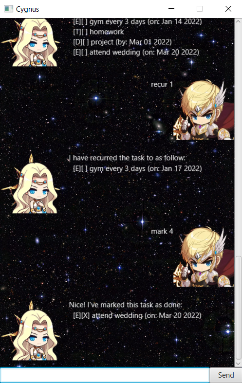

#User Guide for Your Interactive Todo List

Welcome to the user guide for Your Interactive Todo List!

## Why choose us?

Everyone is busy. Everyone has a lot on their mind. We aren't computers and we can't remember everything. So how about we let a computer remember stuff for us? With Your Interactive Todo List, gone are the days that you have to memorise your daily tasks. With our interactive user interface, todo list has never been more fun to use!

## Product Screenshot

## Commands

Here we will list the commands that you need to know in order to use this application

1. help
    - Probably the most important command, it shows you what commands and their formats incase you have forgotten
2. todo, deadline, event
    - These 3 are similar, they represent different type of tasks that you can add to todo list
3. mark, unmark
    - After noting down your tasks, you can even mark / unmark them to remember whether you have done it
4. list
    - This allows you to see all the tasks you currently have

Note: You can find the formats of the commands in the help command
