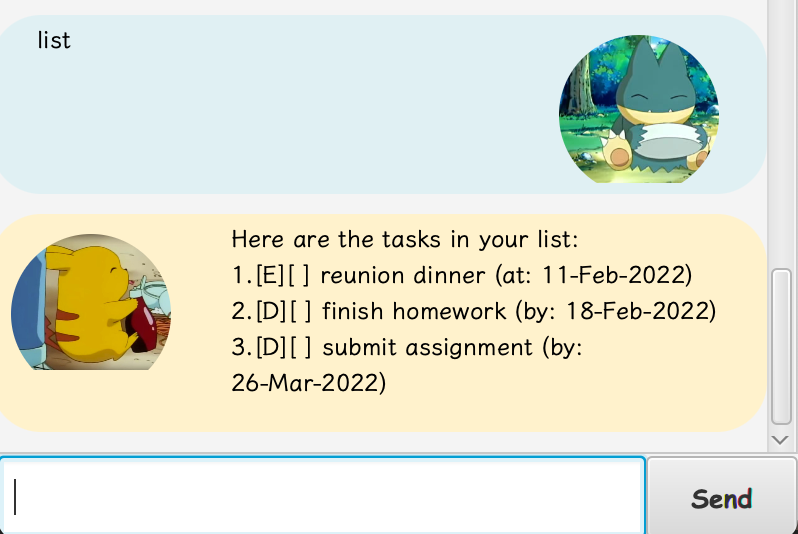
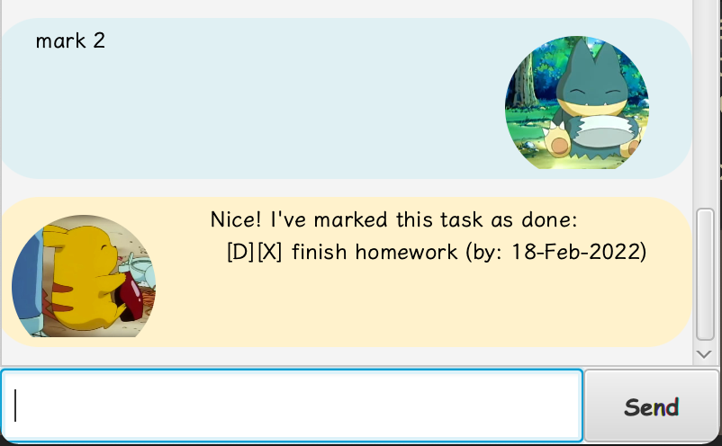
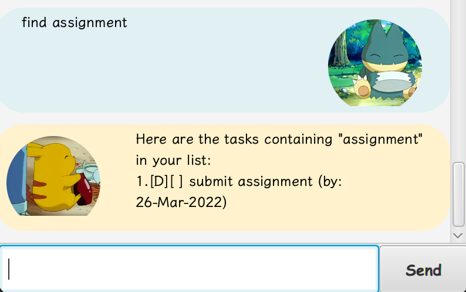

# PikaBot ⚡ ⚡

> "Pikapika!" - *Pikachu*

## Features 

- Adding tasks (todos, events, deadlines)
- Listing tasks
- Marking tasks as done
- Deleting tasks
- Searching for tasks

## Usage

### 1) `todo {task}` / `t {task}` : Creates a new Todo task

Examples of usage: 

`todo go jogging`

`t play badminton`

Expected output:

### 2) `event {event} /at {YYYY-MM-DD}` / `e {event} / at {YYYY-MM-DD}` : Creates a new Event

Examples of usage:

`event cca practice session /at 2022-05-09`

`e reunion dinner /at 2022-02-11`

Expected output:

### 3) `deadline {deadline} /by {YYYY-MM-DD}` / `d {deadline} /by {YYYY-MM-DD}` : Creates a new Deadline

Examples of usage:

`deadline finish homework /by 2022-02-18`

`d submit assignment /by 2022-03-26`

Expected output: 

### 4) `list` : List all current tasks

Example of usage:
`list`

Expected output:

### 5) `mark {taskNumber}` / `m {taskNumber}` : Mark a task as done

Example of usage: 
`mark 2`

Expected output:

### 6) `unmark {taskNumber}` / `um {taskNumber}` : Unmarks a task

Example of usage:
`unmark 2`

Expected output:

### 7) `delete {taskNumber}` / `del {taskNumber}` : Deletes a task

Example of usage:
`del 2`

Expected output:

### 8) `find {keyword}` : Finds a task containing a specific keyword

Example of usage:
`find assignment`

Expected output: 

### 9) `bye` : Exits PikaBot application

Example of usage:
`bye`

