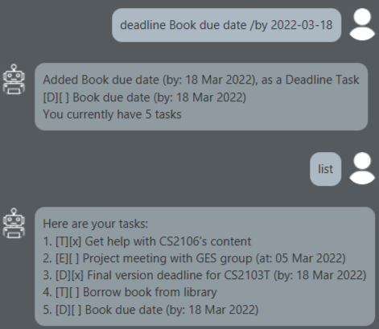

# User Guide
Task List Assistant (TLA) helps you keep track of your tasks and more!\
TLA uses a chat format similar to chat apps when interacting with the assistant.

## Features 

### Tasks

TLA supports 3 main types of tasks:
- Todo Task (normal task with description)
- Event Task (task with a date)
- Deadline Task (task with a deadline)

### Exporting and Importing the Task List with a file
1. Duke saves to task.txt (same working directory) for every modification to the task list.
2. Duke will immediately import tasks from task.txt on startup.

## Usage

To launch the application, you will need Java 11. Download the latest release from [Releases](https://github.com/Kidsnd274/ip/releases)

Launch the application using this command line:
`java -jar TaskListAssistant.jar`

TLA accepts commands from users and modifies the task list in that way.\
These are the available commands:

### `list` - List out all the tasks and their descriptions

Shows all the current tasks in the task list and their descriptions.

Expected outcome:\

### `todo (description)` - Adds a Todo Task with a description

Creates a new Todo Task with the inputted description and adds it to the task list.

Example of usage:\

### `event (description) /at (date YYYY-MM-DD)` - Adds an Event Task with a description and date

Creates a new Event Task with the inputted description and date.

Example of usage:\

### `deadline (description) /by (date YYYY-MM-DD)` - Adds a Deadline Task with a description and date

Creates a new Deadline Task with the inputted description and date.

Example of usage:\

### `mark (task number)` - Marks a task as done.

Marks a task from the task list as done. Use `list` to check the task's number.

Example of usage:\

Expected outcome:\

### `unmark (task number)` - Marks a task as undone.

Marks a task from the task list as undone. Use `list` to check the task's number.

Example of usage:\

Expected outcome:\

### `delete (task number)` - Removes a task from the task list.

Removes a task from the task list. Use `list` to check the task's number.

Example of usage:\

### `postpone (task number) (date YYYY-MM-DD)` - Edit the date in Event and Deadline Tasks.

Edits the date in Event and Deadline Tasks. Use `list` to check the task's number.

Example of usage:\
