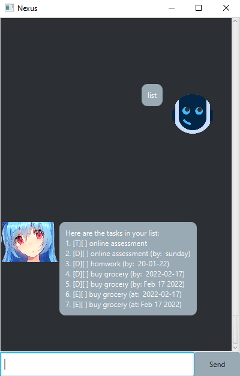
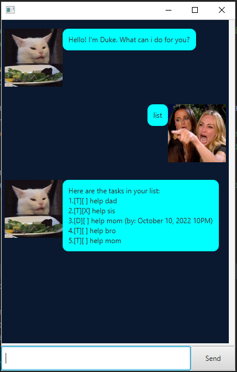

# User Guide
***
## Project Description

This is a greenfield Java project for CS2103T Software Engineering.

>  “Any fool can write code that a computer can understand.
> Good programmers write code that humans can understand.”
> -Martin Fowler.
***
## What is Nexus?

> Nexus is a basic Todo List with a built-in interface for users to interact with.
***
## Instructions
1. Download the .jar file from [here](https://github.com/tandeshao/ip/releases/tag/A-Release).
2. Open the command prompt/terminal.
3. Navigate to the directory of the .jar file.
4. Ensure that you have jdk set up in your local environment.
5. Run `java -jar Launcher.jar`.
6. Let it manage your tasks for you 😃

***
# Features
Note regarding command format: 
- `<integer>` represents the 1-based index of the specific task in the list.
- `<description>` represents a task description.
- `<date>` represents a date that user can specify.

### 1. Show the list of tasks that has yet to be done:``list`` 
**format: `list`** 

### 2. Mark the task as completed:``mark`` 
**format: `mark <integer>`**
- A marked task would look something like `[T][X] <description>` when `list` is called.

**Example:**
- If the first task in the list is `[T][ ] homework` then, `mark 1` would result in `[T][X] homework`.
- If the first task in the list is `[T][ ] homework` then, `mark 0` would result in `[T][ ] homework`.

### 3. Unmark the task as not completed:``unmark`` 
**format:  `unmark`<integer>`**
- An un-marked task would look something like `[T][ ] <description>` when `list` is called.

**Example:**
- If the first task in the list is `[T][X] homework` then, `unmark 1` would result in `[T][ ] homework`.
- If the first task in the list is `[T][ ] homework` then, `unmark 0` would result in `[T][ ] homework`.

### 4. Create a new task that user has to do:`todo` 
**format: `todo <description`**
- Todo tasks would look something like `[T][ ] <description>` when `list` is called.
- They are represented by a `[T]` in the task list.

**Example:**
- `todo online assessment` would result in `[T][] online assessment` to be added into the task list.
- `todo homework` would result in `[T][] homework` to be added into the task list.
- `todo buy grocery` would result in `[T][] buy grocery` to be added into the task list.
- `todo shop for clothes` would result in `[T][] shop for clothes` to be added into the task list.

### 5. Creates a new deadline and a date in which the task has to be completed by: `deadline` 
**format: `deadline`<description> /by <date>`**

- Deadline tasks would look something like `[D][ ] <description> (by: <date>)` when `list` is called.
- They are represented by a `[D]` in the task list.
- They have a deadline specified in the brackets.

**Example:**
- `deadline online assessment /by: sunday` would result in `[D][] online assessment (by: sunday)` to be added into the task list.
- `deadline homework /by: 20-01-22` would result in `[D][] homework (by: 20-01-22)` to be added into the task list.
- `deadline buy grocery /by:2022-02-17` would result in `[D][] buy grocery (by: Feb 17 2022)` to be added into the task list.
- `deadline buy grocery /by: 2022-02-17` would result in `[D][] buy grocery (by: 2022-02-17)` to be added into the task list.

### 6. Creates a new event and a date in which the event is held at: `event` 
**format: `event <description> /at <date>`**
- Event tasks would look something like `[E][ ] <description> (at: <date>)` when `list` is called.
- They are represented by a `[E]` in the task list.
- They have a date specified in the brackets to show when the event is happening.

**Example:**
- `event online assessment /at: sunday` would result in `[E][] online assessment (at: sunday)` to be added into the task list.
- `event homework /at: 20-01-22` would result in `[E][] homework (at: 20-01-22)` to be added into the task list.
- `event buy grocery /at:2022-02-17` would result in `[E][] buy grocery (at: Feb 17 2022)` to be added into the task list.
- `event buy grocery /at: 2022-02-17` would result in `[E][] buy grocery (at: 2022-02-17)` to be added into the task list.

### 7. Find tasks that match the description.`find`
**format: `find <description>`**
- The search is case-insensitive. e.g `GROCERY` will not match with `grocery`. 
- The order of the keywords does not matter. e.g. `grocery` will match with `buy grocery`.
- However, note that `grocery buy` would not match with `buy grocery`.
- Only the name is searched.
- Partial words will be matched e.g. `groc` will match with `grocery`.
- Tasks matching at least one keyword will be returned (i.e. OR search). e.g. `grocery` would match with `buy grocery`.

### 8. Delete the specific task from the list:`delete` 
**format: `delete <integer>`**

### 9. Show the list of commands available in Nexus:`help`
**format: `help`**

***

## FAQ
Q: How do I transfer my data to another Computer?

A: Install the app in the other computer and overwrite the empty data file it creates with the file that contains the data of your previous Nexus home folder.

***
## Command Summary

 Command      | Description                                                                 
--------------|-----------------------------------------------------------------------------
 **list**     | List all new or modified files                                              
 **mark**     | Marks the task as completed.                                                
 **unmark**   | Unmark task as not completed.                                               
 **todo**     | Creates a new task that user has to do.                                     
 **deadline** | Creates a new deadline and a date in which the task has to be completed by. 
 **find**     | Finds tasks that matches the description.                                   
 **delete**   | Deletes the specific task from the list.                                    
 **help**     | Shows the list of commands available in Nexus.                               
