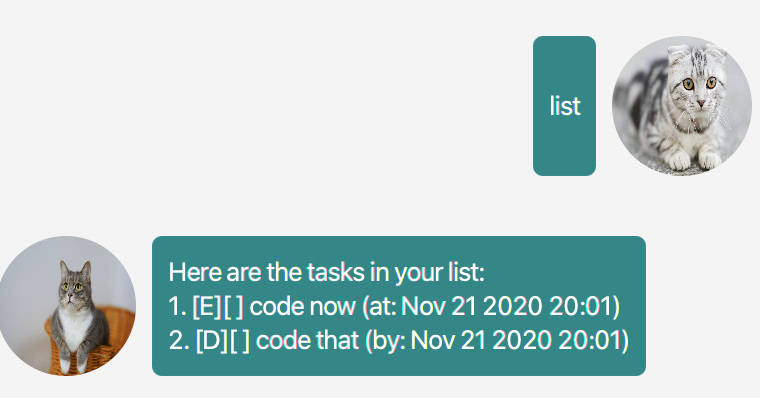

# Jerry User Guide

## Features 

### Jerry is a task manager
Jerry is here to help you track your events!
All you have to do is to tell Jerry what is happening.

### Jerry has a good sense of time
Jerry can look up for tasks based on a specified date! 

### Jerry is reliable
Jerry has an excellent memory! 
He will always remember what you have told him.

### Jerry has incredible lookup skills
Jerry can lookup for tasks based on a keywords provided.


## Usage

### `todo` - Adds a Todo Type Task
Syntax
```
todo [taskName]
```

Creates Todo Type task with the specified name.

Example of usage: 

`todo buy book`

`todo go swimming`

Expected outcome: Jerry adds a Todo Task with the specified name.
Example:


### `deadline` - Adds a Deadline Type Task
Syntax
```
deadline [taskName] /by [deadlineDate]
```
Creates Deadline Type task with the specified name and date.

Example of usage: 

`deadline buy toto /by 11/11/2022`

`deadline go swimming /by 10/10/2022`

Expected outcome: Jerry adds a DeadlineTask with the specified name and date.

Example:


### `event` - Adds a Event Type Task
Syntax
```
event [taskName] /at [eventDate]
```

Creates Event Type task with the specified name and date.

Example of usage: 

`event check toto /at 11/11/2022`

`event buy car /at 10/10/2022`

Expected outcome:  Jerry adds a Event with the specified name and date.
Example:


### `list` - List tasks
Syntax
```
list
list /on     [date]
list /before [date]
list /after  [date]
```

List all tasks currently stored in Jerry's brain. Can fliter by specifying date

Example of usage: 

`list`

`list /on 11/11/2022`

`list /before 11/11/2022`

`list /after 10/10/2022`

Expected outcome: If no filters are specified, Jerry will list all tasks. Else Jerry will only show the tasks that matches the specified date.



### `find` - Find task based on keyword
Syntax
```
find [keyword]
```
List tasks that contains the specified keyword

Example of usage: 

`find toto`

Expected outcome: Jerry displays task(s) with "toto" within its name


### `mark` - Mark Task as done
Syntax
```
mark [taskIndex]
```
Marks the task at the specified index as done.

Example of usage: 

`mark 1`

Expected outcome: Jerry marks the specified task as done


### `unmark` - Unmark Task as done
```
unmark [taskIndex] 
```
Unmarks the task at the specified index as done.

Example of usage: 

`unmark 1`

Expected outcome: Jerry unmarks the specified task as done


### `delete` - Delete tasks
```
delete [taskIndex] 
```

Delete the task at the specified index

Example of usage: 

`delete 1`

Expected outcome: Jerry forgets the task at the specified index

