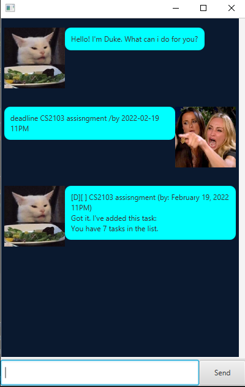
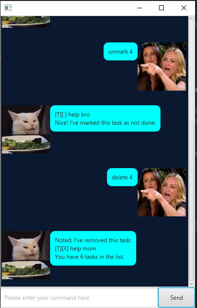

# User Guide for Duke Bot

## Features 

### Create tasks of different types!

 + Normal tasks
 + Tasks with deadlines
 + Tasks with start times

### Set a priority!

 + Give your tasks some sense of urgency
 
### Complete your tasks!
 
 + Delete a task
 + Mark task as completed or not.

### Find your tasks!

 + View all
 + Search by keyword

## Usage

### `list` - Shows all tasks

Shows all tasks in descending priority level.

Example of usage: `list`

Expected outcome:

### `mark` - Marks a task

Marks task as completed.

Example of usage: `mark 2`

Expected outcome:

### `unmark` - Unmarks a task

Marks task as *not* completed.

Example of usage: `unmark 2`

Expected outcome:

### `todo` - Create a new Todo Task

Adds a new Todo Task to the list and saves the updated list to the save file.

Example of usage: `todo mop the floor`

Expected outcome:

### `event` - Create a new Event Task

Adds a new Event Task to the list and saves the updated list to the save file.

Example of usage: `event mop the floor /at 20/02/2022 07:00 PM`

Expected outcome:

### `deadline` - Create a new Deadline Task

Adds a new Deadline Task to the list and saves the updated list to the save file.

Example of usage: `deadline submit assignment /at 01/02/2022 08:02 PM`

Expected outcome:

### `find` - Shows all tasks

Returns all the tasks from the list.

Example of usage: `find floor`

Expected outcome:

### `delete` - Deletes a task

Deletes the task from the list and saves the list to the file.

Example of usage: `delete 1`

Expected outcome:

### `priority` - Sets a priority level on task

Sets a priority level on task, sorts the list based on desecending priority level and saves the list to the file.

Example of usage: `priority 2 2`

Expected outcome:

### `bye` - Exit

Exits the application.

Example of usage: `bye`

Expected outcome:

