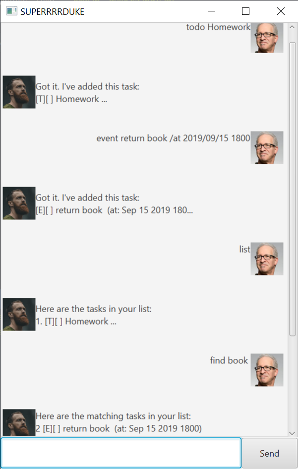

# Larry Bot User Guide

--------------------------------------------------------------------------------------------------------------------

## Features 

Larry Bot is your personal virtual assistant for your scheduling needs!

Want to test it out? Click [here](https://github.com/pyk595/ip/releases) to download the jar file!

Run the program by typing `java -jar larry.jar` in the directory you placed the jar file.

Here are some things you can do:

### Say Hello

Say `hello` to Larry! He will remind you about your previous tasks.

### Add Tasks

Three different types of tasks can be added: To-Dos, Events, and Deadlines.

- To-Do: a task with only a description
- Event: a task with a description and date
- Deadline: a task with a description and due date


### Searching for Tasks

Search for tasks using keywords.

## Some Common Commands

### `todo` - add todo task

Add todo task containing a description.

Example of usage: `todo read book`

Expected outcome:
```
Got it, I added:
[T][] read book
now you have _ items(s) in your list
```
### `event` - add event task

Add event task containing a description and a date.

Example of usage: `event read book /at 2022-03-01`

Expected outcome:
```
Got it, I added:
[E][] read book (at: 1 MARCH 2022)
now you have _ items(s) in your list
```
### `deadline` - add deadline task

Add deadline task containing a description and a due date.

Example of usage: `event read book /by 2022-03-01`

Expected outcome:
```
Got it, I added:
[D][] read book (by: 1 MARCH 2022)
now you have _ items(s) in your list
```
### `list` - list tasks

Display a consolidated list of tasks with the type, status,
description and dates.

Example of usage: `list`

Expected outcome:
```
---------------------------------------
Here's your list, Good Sir:
1. [T][] read book
2. [E][] read book (at: 1 MARCH 2022)
3. [D][] read book (by: 1 MARCH 2022)
---------------------------------------
```

### `bye` - exit

Displays a goodbye message and exits the bot

Example of usage: `bye`

Expected outcome:
```
Bye. Hope to see you again soon!
```

## Example

Here's how it should look:



--------------------------------------------------------------------------------------------------------------------
## Command Summary

|Action | Format, Examples |
--------|------------------
**Welcome** | `hello`
**Add To-Do** | `todo TASK` <br> e.g., `todo eat dinner`
**Add Event** | `event TASK /at YYYY-MM-DD` <br> e.g., `event breakfast /at 2022-01-01`
**Add Deadline** | `deadline TASK /by YYYY-MM-DD` <br> e.g., `deadline eat breakfast /by 2022-01-01`
**Mark** | `mark INDEX`<br> e.g., `mark 3`
**Unmark** | `unmark INDEX`<br> e.g., `unmark 3`
**Delete** | `delete INDEX`<br> e.g., `delete 3`
**Edit** | `update INDEX [NEW DESCRIPTION]`<br> e.g.,`update 1 eat lunch`
**Find** | `find [KEYWORD] `<br> e.g., `find read`
**List** | `list`
**Exit** | `bye`
