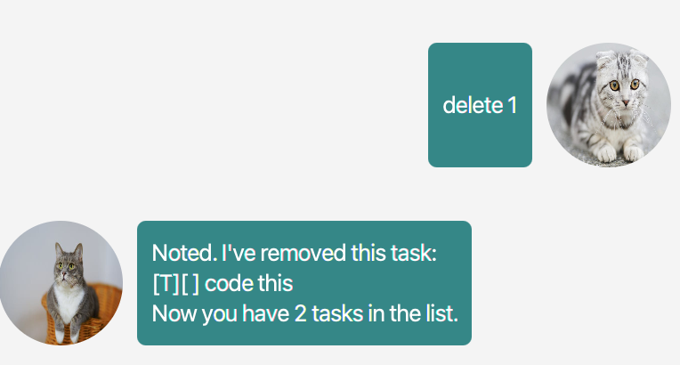
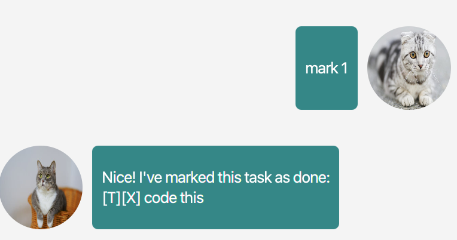

# Dusk User Guide

## Features 

### Manage personal events, deadlines and tasks

Dusk is a chatbot-style task management app that allows users to track upcoming deadlines, tasks, and events in an organised manner.

## Usage

### `list` - Lists all tasks

Shows the title, type and state (marked/unmarked) of all tasks

Example of usage: `list`

Expected outcome: Bot will reply with a list of tasks currently in the user's list

First box displays the type of task, `T` for todo, `D` for deadline, `E` for event

Example:

### `todo` - Add a todo task

Adds a todo task into the task list. Todo tasks contain a title and a marked/unmarked state

Example of usage: `todo {title of task}`

Expected outcome: Bot adds task to current task list

Example:

### `deadline` - Add a deadlined task

Adds a deadlined task into the task list. Deadline tasks contain a title and date. Time is optional

Example of usage: `deadline {title of task} /by {date} {time}`

Dates are to be entered in the format: `yyyy-mm-dd`

Time is to be entered in the format: `hh:mm`

Expected outcome: Bot will reply if the task has been successfully added

Example:

### `event` - Add an event

Adds an event into the task list. Events contain a title and date. Time is optional

Example of usage: `event {title of task} /at {date} {time}`

Dates are to be entered in the format: `yyyy-mm-dd`

Time is to be entered in the format: `hh:mm`

Expected outcome: Bot will reply if the event has been successfully added

Example:

### `delete` - Deletes a task

Deletes a task from the task list based on the number on the list

Example of usage: `delete {task number}`

Expected outcome: Bot will reply if the event has been successfully deleted

Example:

### `mark` - Mark a task as completed/finished

Marks a task based on the number on the list

Example of usage: `mark {task number}`

Expected outcome: Bot will reply if the event has been successfully marked

Example:

### `unmark` - Mark a task as completed/finished

Unmarks a task based on the number on the list

Example of usage: `unmark {task number}`

Expected outcome: Bot will reply if the event has been successfully unmarked

Example:

### `update` - Modifies current attributes of a task

Updates a task based on the number on the list

Example of usage: `update {task number} {attribute to modify} {edited value}`

Attributes to modify are indicated by the following: `/title`, `/date` or `/time`

Dates are to be entered in the format: `yyyy-mm-dd`

Time is to be entered in the format: `hh:mm`

Expected outcome: Bot will reply if the event has been successfully updated

Example:

