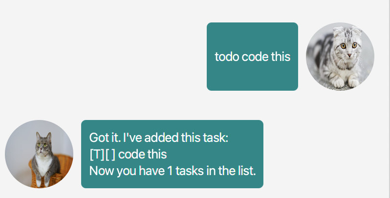
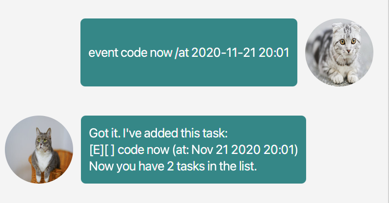
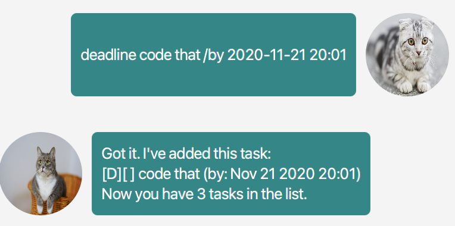
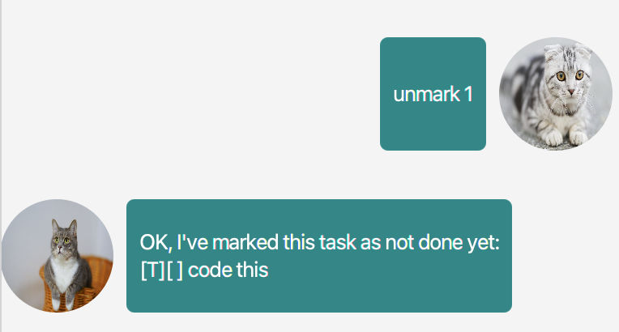
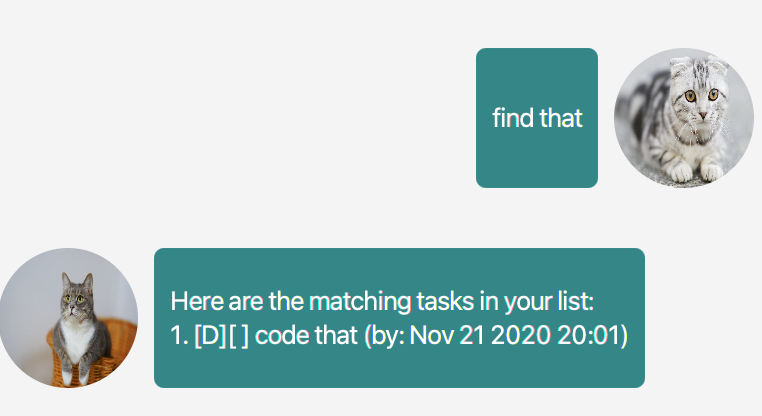

# User Guide for ChatCat
Need a program written by java to help you keep track of your tasks ? ChatCat is the perfect program for you! 😄

## Features 
1. Add a task
2. Delete a task
3. Marks task as completed
4. Unmarks a previously completed task
5. Finds all tasks containing a specified keyword
6. Lists all tasks in task list

## Tasks
### There are 3 tasks that you can add into ChatCat
1. Todo - A task with only a description
2. Deadline - A task that has both a description and deadline
3. Event - A task that has both a description and event date

## Commands ChatCat offers
### `todo` - Add todo task
Format: `todo <description of task>`  
Usage: `todo code this`  
#### Expected outcome:

### `event` - Add event task
format: `event <description of event> /at <YYYY-MM-dd HH:mm>`  
Usage: `event code now /at 2020-11-21 20:01`  
#### Expected outcome:

### `deadline` - Add deadline task
format: `deadline <description of deadline> /by <YYYY-MM-dd HH:mm>`  
Usage: `deadline code that /by 2020-11-21 20:01`  
#### Expected outcome:

### `mark` - Mark task as completed
Format: `mark <index of task to mark>`  
Usage: `mark 1`  
#### Expected outcome:

### `unmark` - Unmarks task that was previously marked as completed
Format: `unmark <index of task to mark>`  
Usage: `unmark 1`  
#### Expected outcome:

### `delete` - Delete a task
Format: `delete <index of task to be deleted>`  
Usage: `delete 1`  
#### Expected outcome:

### `find` - find all tasks that contain a keyword
Format: `find <keyword>`  
Usage: `find that`  
#### Expected outcome:  

### `list` - List all tasks
Format: `list`  
Usage: `list`  
#### Expected outcome:

### `bye` - Exits ChatCat
Format: `bye`  
Usage: `bye`
#### Expected outcome:

