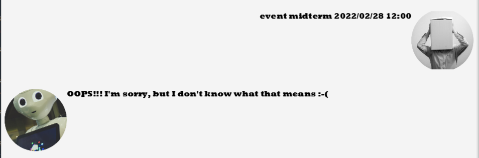
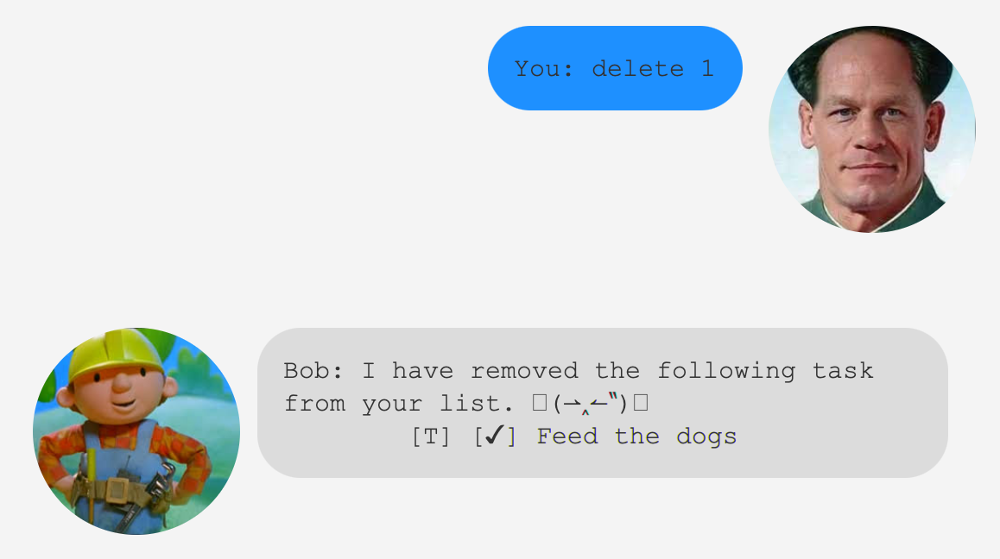

# User Guide for Bobby

## Bobby is a simple task tracker that helps remind you about your upcoming tasks.

### Tasks that Bobby can track for you
- To-Do
- Deadlines
- Events

### Features
- `List`
- `Find`
- `Mark` 
- `Unmark`
- `Delete`
- `Automatically sorts deadlines and events`

# Usage

## Adding tasks

Adds a ToDo, Event or Deadline task into the Bobby's list. 

The format for the date must be: dd-mm-yyyy

### Example of usage 

`todo buy groceries`

`event Dr Strange Multiverse of Madness / 06-05-2022`

`deadline Renew passport!! / 31-03-2022`

### Outcome

Bobby replies with a confirmation message that he added your task into the list
and tells you how many tasks are currently in your list. 

###`todo`: 

###`event`:

###`deadline`:

## List

Bobby will list out your current tasks. 

Events and Deadlines displayed first before To-Do's. 
Events and Deadlines sorted by default with the earliest date first.

### Example of usage
`list`

### Outcome
Bobby shows your current tasks.

## Find

Find tasks that contains the provided keyword.

### Example of usage
`find passport`

`find buy`

`find n`

### Outcome
Bobby will search through all your tasks for the keyword and displays them to you.

The output list will be sorted by default as well.

## Mark

Bobby helps you to mark the task with the given index as done.

### Example of usage

`mark 3`

### Outcome
Bobby marks the task as done by putting an `X` beside the task 

## Unmark

Bobby helps you to unmark the task with the given index as not done.

### Example of usage

`unmark 3`

### Outcome
Bobby unmarks the task as not done by removing the `X` beside the task.

## Delete

Bobby removes the task from your list.

### Example of usage

`delete 3`

`delete all`

### Outcome
Bobby removes the task with the given index from your list.

If `delete all`, bobby removes the whole list!

## Note
All commands are case-insensitive.
### For example:
`delete all` is the same as `DELete aLL`.