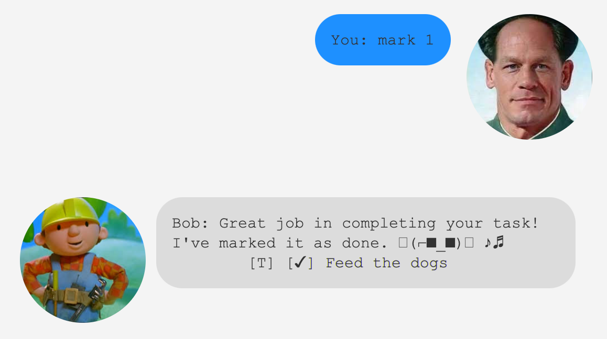

# [Bob](https://ryan-l98.github.io/ip/)
A task tracker to help you remember what when and if you already completed a task.
> The best task tacker I have ever used
> it has made my life so much better - me

### Types of tasks Bob can currently track
1. To do
2. Events
3. Deadlines

## Features 
- `List`
- `Find`
- `Mark`
- `Delete`
- `Priority`
- `PriorityList`

## Usage

### `List` - lists out tasks

Bob will show you the lists of tasks that you have to complete.

### `Find` - find tasks containing the search keyword 

Bob will find and list all tasks that contain the keyword in the search.

### `Mark` - marks task of given index

Bob will mark the task with the given index as done.

### `Delete` - deletes the task of the given index

Bob will delete the task with the given index.

### `Priority` - tags the task of given index with given priority

Bob will tag the task with the priority level provided.
Priority levels available are as follows: `HIGH`,  `MEDIUM`, `LOW`, `NONE`

### `PriorityList` - lists out tasks based on their priority

Bob will generate a lists of your tasks based on their priority.

#### Note: All commands are case-insensitive.

