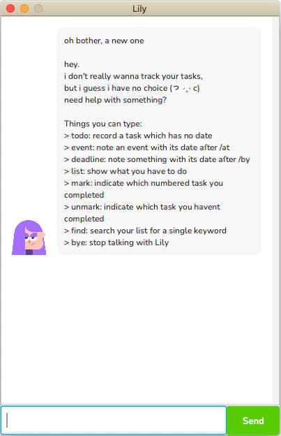

# AnnBot User Guide
AnnBot is a **desktop app for managing your tasks**. It's optimized for usage via a **Command Line Interface (CLI)** while still having the benefits of a Graphical User Interface (GUI).

* [Quick Start](./README.md#quick-start)
* [Features](./README.md#features)
    * Adding a task
      * [Adding a deadline](./README.md#adding-a-deadline-add-deadline)
      * [Adding an event](./README.md#adding-an-event-add-event)
      * [Adding a todo](./README.md#adding-a-todo-add-todo)
    * [Deleting a task](./README.md#deleting-a-task-delete)
    * [Viewing the list of tasks](./README.md#viewing-the-list-of-tasks-list)
    * [Finding a task](./README.md#finding-a-task-find)
    * [Marking a task as done](./README.md#marking-a-task-as-done-mark)
    * [Marking a task as not done](./README.md#marking-a-task-as-done-unmark)
    * [Exiting](./README.md#exiting-bye)
    
## Quick Start
1. Ensure you have Java `11` or above installed in your PC.
2. Download the latest `ann.jar` from [here](https://github.com/honganhcs/ip/releases).
3. Copy the file to the folder you want to use as the *home folder* for your **AnnBot**.
4. Double-click the file to start the app. A GUI similar to the below should appear in a few seconds.

## Features 

### Adding a deadline: `add deadline`
Adds a deadline to the task list.

Format: `add deadline CONTENT /by yyyy-MM-dd HH:mm`
* Adds a deadline with the specified `CONTENT`, date and time.
* The date and time must be in the above format.

Example: `add deadline finish homework /by 2022-02-12 18:00`

### Adding an event: `add event`
Adds an event to the task list.

Format: `add event CONTENT /at yyyy-MM-dd HH:mm`
* Adds an event with the specified `CONTENT`, date and time.
* The date and time must be in the above format.

Example: `add event meet Prof /at 2022-02-12 18:00`

### Adding a todo: `add todo`
Adds a todo to the task list.

Format: `add todo content`
* Adds a todo with the specified content. 

Example: `add todo watch lecture`

### Deleting a task: `delete`
Deletes a task from the task list.

Format: `delete INDEX`
* Deletes the task at the specified `INDEX`.
* `INDEX` must be a **positive integer** 1, 2, 3,...

Example: `delete 1`

### Viewing the list of tasks: `list`
Displays the list of tasks to the user.

Format: `list`
### Finding a task: `find`
Displays relevant tasks to the user.

Format: `find KEYWORDS`
* Displays tasks that match at least one of the `KEYWORDS`.

Example: `find finish homework event`
### Marking a task as done: `mark`
Marks a task as done.

Format: `mark INDEX`
* Marks the task at the specified `INDEX` as done.
* `INDEX` must be a **positive integer** 1, 2, 3,...

Example: `mark 2`

### Marking a task as done: `unmark`
Marks a task as not done.

Format: `unmark INDEX`
* Marks the task at the specified `INDEX` as not done.
* `INDEX` must be a **positive integer** 1, 2, 3,...

Example: `unmark 3`
### Exiting: `bye`
Exits from the app.

Format: `bye`
* Shows a pop-up message asking the user to confirm their decision.
* If the user clicks on the **Yes** button, the user will exit from the app.
* If the user clicks on the **No** button, the user can continue to use the app.
