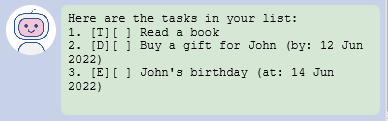
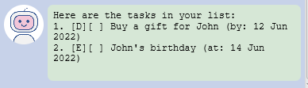

# User Guide
Duke is a Task Management app that helps you manage 3 types of tasks: todos, deadlines and events.
- [Quick Start](#quick-start)
- [Features](#features)
    - [Add a Todo](#add-a-todo)
    - [Add a Deadline](#add-a-deadline)
    - [Add an Event](#add-an-event)
    - [Show task list](#show-task-list)
    - [Mark and Unmark a task](#mark-and-unmark-a-task)
    - [Delete a task](#delete-a-task)
    - [Find tasks by keyword](#find-tasks-by-keyword)
    - [Remind scheduled tasks](#remind-scheduled-tasks)
    - [Save the data](#save-the-data)
    - [Exit the app](#exit-the-app)
- [Command Summary](#command-summary)
----

## Quick Start
1. Ensure your computer has ***Java 11 or above*** installed.
2. Download the latest release of ***duke.jar*** file from [here](https://github.com/cpwill01/ip/releases/latest).
3. Copy the file to a folder you want to use as the home directory for your Duke.  
   Note that a `/data` folder will be created in this home directory.
5. Double-click the file to start the app.
6. Type a command in the command box and press Enter to execute it.  
   Alternatively, you may also press the Send button instead of pressing Enter.
8. Refer to [Features](#features) below for details of each command and [Command Summary](#command-summary) for a quick reference table of all commands.
---

## Features
:exclamation::exclamation::exclamation::exclamation:**Important notes about the command format**:exclamation::exclamation::exclamation::exclamation:
- Command names are **case-insensitive**  
  e.g. `list`, `LIST`, `LiSt`, etc. are all valid commands
- Words in `UPPER_CASE` are the parameters to be supplied by the user.  
  e.g. in `todo DESCRIPTION`, `DESCRIPTION` is a parameter which can be used as `todo Read a book`
- Parameters in square brackets are optional.
- For commands that do not take in any parameter (`list` and `bye`), any parameter supplied will be ignored.

 

### Add a Todo

Adds a todo to the task list. A todo is a task with only a description.

Format: *todo DESCRIPTION*

Usage: `todo Read a book`
- adds a `todo` with the description `Read a book`
- reflected by Duke as `[T][ ] Read a book`.

 

### Add a Deadline

Adds a deadline to the task list. A deadline is a task that is scheduled to end by an end date.

Format: *deadline DESCRIPTION /by YYYY-MM-DD*
- `/by` is case-insensitive, so it can also be written as `/By`, `/bY` or `/BY`

Usage: `deadline Buy a gift for John /by 2022-06-12`
- adds a deadline that is due on `12 June 2022` with the description `Buy a gift for John`
- reflected by Duke as `[D][ ] Buy a gift for John (by: 12 Jun 2022)`.

 

### Add an Event

Adds an event to the task list. An event is a task that is scheduled to start on a start date.

Format: *event DESCRIPTION /at YYYY-MM-DD*
- `/at` is case-insensitive, so it can also be written as `/At`, `/aT` or `/AT`

Usage: `event John's birthday /at 2022-06-14`
- adds an event that will start on `14 June 2022` with the description `John's birthday`
- reflected by Duke as `[E][ ] John's birthday (at: 14 Jun 2022)`.

 

### Show task list

Shows all tasks currently in the task list.

Format: *list*

 

### Mark and unmark a task

#### Mark a task
Marks a task as done.

Format: *mark INDEX*
- the `INDEX` of a task is its position in the task list, which is the number shown beside the task when the `list` command is used
- the `INDEX` must be a positive integer (1, 2, 3, ...)

Usage: `mark 1` marks the first task in the task list. For example, if your current task list is:  

- the todo `1. [T][ ] Read a book` will be marked as done
- reflected by Duke as `[T][X] Read a book`

#### Unmark a task
Unmarks a task. In other words, marks a task as not done.

Format: *unmark INDEX*
- the `INDEX` of a task is its position in the task list, which is the number shown beside the task when the `list` command is called
- the `INDEX` must be a positive integer (1, 2, 3, ...)

Usage: `unmark 1` unmarks the first task in the task list. Using the same example as above:
- the todo `1. [T][X] Read a book` will be unmarked.
- reflected by Duke as `[T][ ] Read a book`

 

### Delete a task
Deletes a task. All tasks originally below the deleted task will have the index decreased by 1.

Format: *delete INDEX*
- the `INDEX` of a task is its position in the task list, which is the number shown beside the task when the `list` command is called
- the `INDEX` must be a positive integer (1, 2, 3, ...)

Usage: `delete 1` deletes the first task in the task list. For example, the task list  
  
becomes  

 

### Find tasks by keyword
Finds tasks whose description contains the keyword.

Format: *find KEYWORD*
- `KEYWORD` is case-insensitive   e.g. `buy 3 eggs` matches `Buy 3 eggs`, `BUY 3 EGGS`, etc.
- `KEYWORD` can contain spaces
- only tasks with descriptions that contain the **entire** `KEYWORD` (including spaces) are returned  
  e.g. `find buy 3 eggs` cannot find tasks with the description `buy 3eggs` or `buy 3x eggs`
- the `date` portion of Events and Deadlines are not searched

Usage: `find a book` returns `[T][ ] Borrow a book` and `[T][ ] Read a book`

 

### Remind scheduled tasks
Reminds you of events and deadlines that are scheduled within a given number of days.

Format: *remind \[DAYS_FROM_TODAY]*
- todos are never returned by this command.
- if no parameter is supplied, the command is equivalent to `remind 7`.
- the days between `today` and `today + DAYS_FROM_TODAY` (both inclusive) will be searched  
  e.g. if today is *1 Jan 2022*, `remind 2` will search the 3 dates *1 Jan 2022, 2 Jan 2022 and 3 Jan 2022*.

Usage: `remind 10` on *7 Feb* returns events and deadlines scheduled any day on or in between *7 Feb* and *17 Feb*.

 

### Save the data
Data is automatically saved locally after any commands that modify the data (i.e. adding, deleting, marking & unmarking). It is saved in the file `duke.txt` in the `/data` folder located within the same directory as `duke.jar`.

If this is your first time using Duke, the `/data` folder and `duke.txt` file will be created automatically upon adding your first task.

 

### Exit the app
Exits the app.

Format: *bye*

---

### Command Summary
Command | Format | Example
--------|--------|-------
todo    | `todo DESCRIPTION` | `todo go grocery shopping for eggs & milk`
deadline| `deadline DESCRIPTION /by YYYY-MM-DD` | `deadline Write a user guide /by 2022-02-18`
event   | `event DESCRIPTION /at YYYY-MM-DD` | `event Hang out with bestie /at 2022-02-22`
list    | `list`
mark    | `mark INDEX` | `mark 1`
unmark  | `unmark INDEX` | `unmark 1`
delete  | `delete INDEX` | `delete 1`
find    | `find KEYWORD` | `find Grocery shopping`
remind  | `remind [DAYS_FROM_TODAY]` | `remind` or `remind 4`
bye     | `bye`
